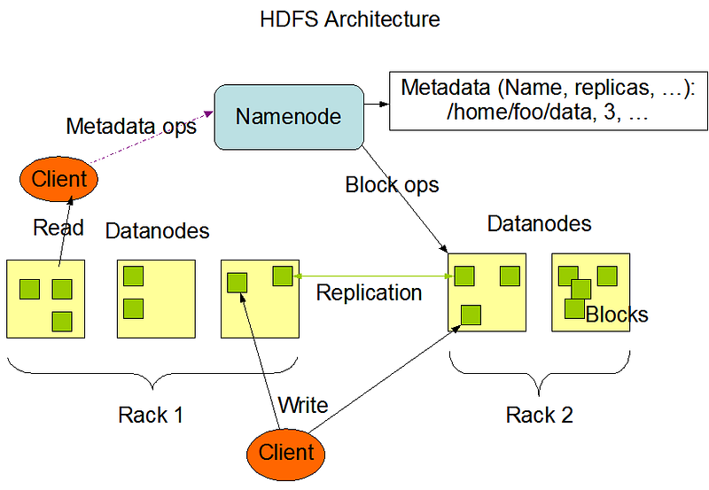
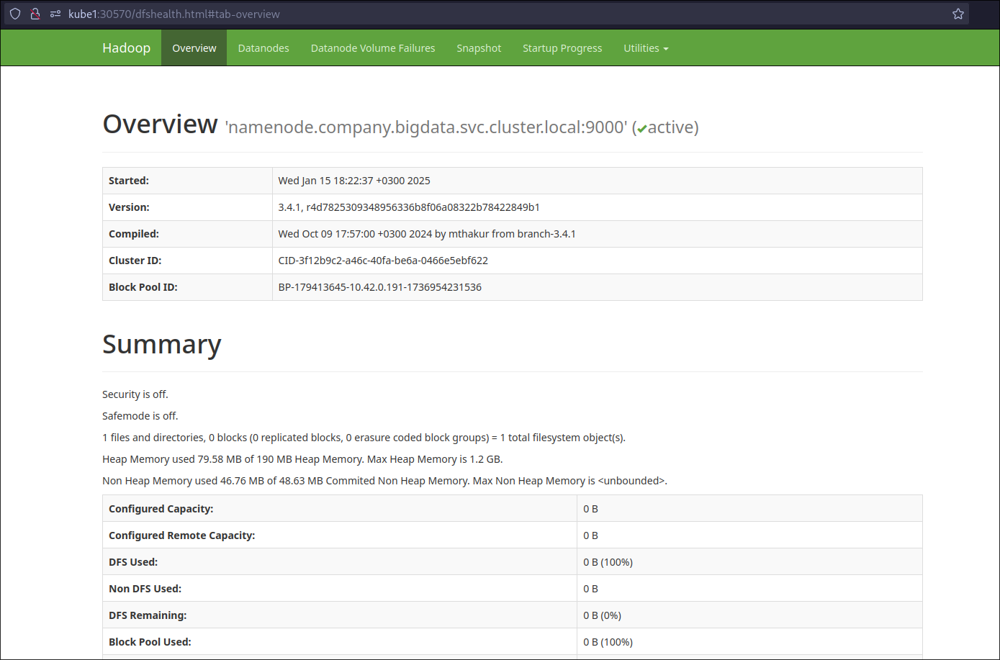
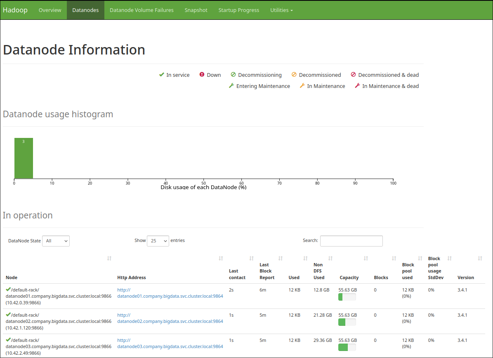
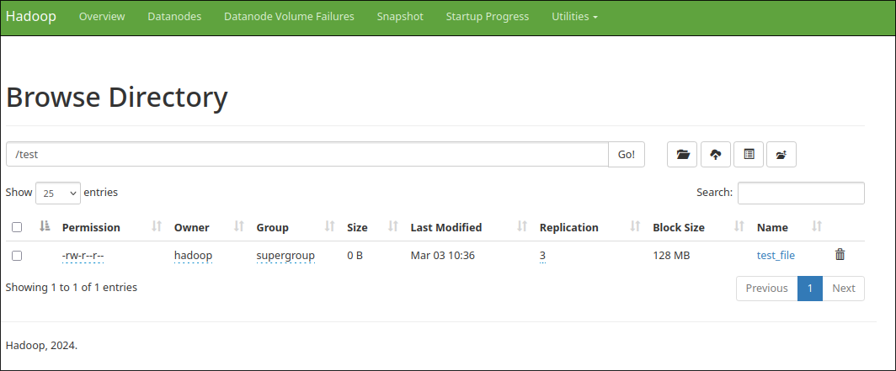

# HDFS

## Foreword

Deploying HDFS on Kubernetes is a complex task. Fortunately, Apache provides official Docker images on [Docker Hub](https://hub.docker.com/r/apache/hadoop/tags), which serve as a good starting point. However, the critical decision lies in selecting the appropriate Kubernetes storage type, as HDFS requires persistent data storage.

In a traditional HDFS setup, data is stored on disks in dedicated servers. Kubernetes, however, emphasizes resource abstraction, meaning resources should not be tied to specific nodes. This requires the use of persistent volumes. A suitable CSI (Container Storage Interface) driver is essential, and the choice depends on factors such as network speed, environment, data replication (for the CSI driver), and HDFS replication. While it is technically possible to deploy HDFS in the traditional way on Kubernetes, it may not align with Kubernetes' design principles.

HDFS is highly fault-tolerant, protecting against data loss even if some nodes fail—similar to Kubernetes. These similarities allow for multiple architectural approaches to deploying HDFS on Kubernetes. Below are three common methods:

1. **Using Persistent Volumes and StatefulSets**: This approach uses Persistent Volumes for storage and StatefulSets to manage the NameNode and DataNodes. It is flexible and aligns well with Kubernetes' design principles.
2. **Using Host Disks with Node Affinity**: This method uses host disks for storage and ties Kubernetes Pods to specific nodes using selectors. It is a more traditional, node-dependent setup.
3. **Using StatefulSets for the NameNode and DaemonSets for the DataNodes**: This hybrid approach combines StatefulSets and DaemonSets for different HDFS components.

...

Each method has its trade-offs. For my home-level setup, the second method (host disks with node affinity) seemed more suitable. Kubernetes ensures high availability at the container level, while HDFS handles data protection against hardware failures. Additionally, learning through Kubernetes Pods as atomic units makes the concepts clearer and more practical.

!!! tip
    Depending on your architecture, you might consider using external cloud object storage (e.g., S3, Azure Blob) or deploying HDFS or MinIO outside the Kubernetes cluster.

In this documentation, I will demonstrate a basic HDFS setup consisting of a single NameNode and multiple DataNodes. The setup will use three nodes: `kube1`, `kube2`, and `kube3` as DataNodes, with `kube1` also serving as the NameNode.

For simplicity, I will not deploy additional components such as ResourceManager (YARN), a secondary NameNode, JournalNode, Failover Controller, or HDFS Federation. YARN is unnecessary because we will deploy Spark on Kubernetes and use Trino instead.

## Namespace

The first step is to create a namespace for the big data services:

```bash
kubectl create namespace bigdata
```

## Namenode



> HDFS follows a master/slave architecture. An HDFS cluster consists of a single NameNode, which acts as the master server, managing the file system namespace and regulating client access to files.

The NameNode requires persistent storage to maintain metadata about the file system. First, create the necessary directory on the node (in this case, `kube1`) and set the correct ownership:

```bash
mkdir -p /hadoop/nn
chown -R 1000:1000 /hadoop/nn
```

!!! danger
    Ensure that ownership and permissions are set correctly. Most startup issues are caused by permission errors.

The structure of the main development folder is as follows:

```
.
├── configs
│   ├── core-site.xml
│   └── hdfs-site.xml
└── namenode.yaml
```

The YAML file for the NameNode Pod and its associated services is shown below:

```yaml
apiVersion: v1
kind: Pod
metadata:
  name: namenode
  namespace: bigdata
  labels:
    app: namenode
    dns: hdfs-subdomain
spec:
  nodeSelector:
    kubernetes.io/hostname: "kube1"
  hostname: namenode
  subdomain: company
  containers:
    - name: namenode
      image: apache/hadoop:3.4.1
      command: ["/bin/bash", "-c"]
      args:
        - |
          if [ ! -d "/hadoop/nn/current" ]; then
              hdfs namenode -format -force
          fi
          hdfs namenode
      resources:
        limits:
          memory: "1G"
          cpu: "500m"
      volumeMounts:
        - name: hadoop-config
          mountPath: /opt/hadoop/etc/hadoop/core-site.xml
          subPath: core-site.xml
        - name: hadoop-config
          mountPath: /opt/hadoop/etc/hadoop/hdfs-site.xml
          subPath: hdfs-site.xml
        - name: namenode-path
          mountPath: /hadoop/nn
  volumes:
    - name: namenode-path
      hostPath:
        path: /hadoop/nn
        type: Directory
    - name: hadoop-config
      configMap:
        name: hadoop-config
---
apiVersion: v1
kind: Service
metadata:
  name: company
  namespace: bigdata
spec:
  selector:
    dns: hdfs-subdomain
  clusterIP: None
  ports:
    - name: rpc
      port: 9000
---
apiVersion: v1
kind: Service
metadata:
  name: namenode-np
  namespace: bigdata
spec:
  type: NodePort
  selector:
    app: namenode
  ports:
    - name: namenode-ui
      port: 50470
      targetPort: 50470
      nodePort: 30570
```

We use the latest Docker image, **apache/hadoop:3.4.1**. To ensure the NameNode runs on the `kube1` node, we configure a node selector:

```yaml
nodeSelector:
  kubernetes.io/hostname: "kube1"
```

To maintain consistent hostnames (FQDNs) for Kerberos principals, we leverage Kubernetes' DNS service. By setting the **hostname** and **subdomain**, Kubernetes assigns the FQDN as `namenode.company.bigdata.svc.cluster.local`.

- [Kubernetes DNS Documentation](https://kubernetes.io/docs/concepts/services-networking/dns-pod-service/#a-aaaa-records)

!!! tip
    If a headless Service exists in the same namespace as the Pod, with the same name as the subdomain, the cluster's DNS server will also return A and/or AAAA records for the Pod's fully qualified hostname.
    ```yaml
    hostname: namenode
    subdomain: company
    ```

When initializing HDFS for the first time, it must be formatted. This involves setting up a new distributed filesystem. We include the following command in the Pod's startup process to ensure the mounted path is formatted if `/hadoop/nn/current` does not exist. Finally, the NameNode is started:

```yaml
command: ["/bin/bash", "-c"]
args:
- |
  if [ ! -d "/hadoop/nn/current" ]; then
      hdfs namenode -format -force
  fi
  hdfs namenode
```

The host path `/hadoop/nn` is mounted from the node, and the required Hadoop configurations are retrieved from the ConfigMap:

```yaml
volumes:
  - name: namenode-path
    hostPath:
      path: /hadoop/nn
      type: Directory
  - name: hadoop-config
    configMap:
      name: hadoop-config
```

To manage HDFS configurations, two files are required: `core-site.xml` and `hdfs-site.xml`.

- Default **core-site.xml**: [Hadoop Core Default Config](https://hadoop.apache.org/docs/current/hadoop-project-dist/hadoop-common/core-default.xml)
- Default **hdfs-site.xml**: [Hadoop HDFS Default Config](https://hadoop.apache.org/docs/current/hadoop-project-dist/hadoop-hdfs/hdfs-default.xml)

The following configurations are essential for deploying the NameNode. You can find the `core-site.xml` and `hdfs-site.xml` files in my GitHub repository:

#### `configs/core-site.xml`

```xml
<configuration>
    <property>
        <name>fs.defaultFS</name>
        <value>hdfs://namenode.company.bigdata.svc.cluster.local:9000</value>
    </property>
</configuration>
```

#### `configs/hdfs-site.xml`

```xml
<configuration>
    <property>
        <name>dfs.namenode.name.dir</name>
        <value>/hadoop/nn</value>
    </property>
    <property>
        <name>dfs.webhdfs.enable</name>
        <value>true</value>
    </property>
    <property>
        <name>dfs.http.address</name>
        <value>0.0.0.0:50470</value>
        <final>true</final>
    </property>
</configuration>
```

We use a ConfigMap to distribute the HDFS configuration files to the Pods:

```bash
kubectl create configmap hadoop-config -n bigdata --from-file=core-site.xml=./configs/core-site.xml --from-file=hdfs-site.xml=./configs/hdfs-site.xml
```

A headless Service is created with the same name as the subdomain. Kubernetes will generate A/AAAA records for this Service. To utilize this headless Service, the `dns: hdfs-subdomain` label must be added to the relevant object:

```yaml
apiVersion: v1
kind: Service
metadata:
  name: company
  namespace: bigdata
spec:
  selector:
    dns: hdfs-subdomain
  clusterIP: None
  ports:
    - name: rpc
      port: 9000
```

Finally, we create a NodePort Service to access the Web UI:

```yaml
ports:
  - name: namenode-ui
    port: 50070
    targetPort: 50070
    nodePort: 30570
```

To start the NameNode, run the following command:

```bash
kubectl apply -f namenode.yaml
```

If everything is configured correctly, you can access the NameNode Web UI at **http://dns_or_ip_of_any_k8s_node:30570**:



## Datanodes 

Datanodes requires persistent storage to store data. First, create the necessary path on data nodes and then set owner (in my case, `kube1`, `kube2`, `kube3`).

```sh
mkdir -p /hadoop/disk1
chown -R 1000:1000 /hadoop/disk1
```

The YAML file for the first datanode:

=== "datanode_01.yaml"

```yaml
apiVersion: v1
kind: Pod
metadata:
  name: datanode01
  namespace: bigdata
  labels:
    app: datanode01
    dns: hdfs-subdomain
spec:
  nodeSelector:
    kubernetes.io/hostname: "kube1"
  hostname: datanode01
  subdomain: company
  containers:
    - name: datanode01
      image: apache/hadoop:3.4.1
      command: ["/bin/bash", "-c"]
      args:
        - |
          hdfs datanode
      resources:
        limits:
          memory: "512M"
          cpu: "500m"
      volumeMounts:
        - name: hadoop-config
          mountPath: /opt/hadoop/etc/hadoop/core-site.xml
          subPath: core-site.xml
        - name: hadoop-config
          mountPath: /opt/hadoop/etc/hadoop/hdfs-site.xml
          subPath: hdfs-site.xml
        - name: datanode-path
          mountPath: /hadoop/disk1
  volumes:
    - name: datanode-path
      hostPath:
        path: /hadoop/disk1
        type: Directory
    - name: hadoop-config
      configMap:
        name: hadoop-config
```

It is similar to the namenode. We just change start script as hdfs datanode and mount `/hadoop/disk1` path.
We need to add disk's location to `hdfs-site.xml` and update `hadoop-conf` ConfigMap. Since directories that not exist are ignored, we can add all possible disks here.

=== "configs/hdfs-site.xml"

```xml
...
<property>
  <name>dfs.datanode.data.dir</name>
  <value>/hadoop/disk1</value>
  <description>Determines where on the local filesystem an DFS data node
      should store its blocks. If this is a comma-delimited
      list of directories, then data will be stored in all named
      directories, typically on different devices.
      Directories that do not exist are ignored.
  </description>
  <final>true</final>
</property>
...
```

```sh
kubectl -n bigdata delete configmaps hadoop-config
kubectl create configmap hadoop-config -n bigdata --from-file=core-site.xml=./configs/core-site.xml --from-file=hdfs-site.xml=./configs/hdfs-site.xml
Redeploy namenode and deploy datanodes:
kubectl delete -f namenode.yaml
kubectl apply -f namenode.yaml
kubectl apply -f datanode_01.yaml
kubectl apply -f datanode_02.yaml
kubectl apply -f datanode_03.yaml
```

Now we can see data nodes on namenode web UI:



Also now we can use hdfs cli commands. First we should access namenode bash:

```sh
kubectl -n bigdata exec -it namenode -- bash
```

You can execute following commands to test:

```sh
hdfs dfs -ls /
hdfs dfs -mkdir /test
hdfs dfs -touch /test/test_file
hdfs dfs -ls /test
```

If you want to add more data node, you should change only the following parameters inside new data nodes `yaml` file:

```yaml
....
metadata:
  name: datanode03 #!!!
  namespace: bigdata
  labels:
    app: datanode03 #!!!
    dns: hdfs-subdomain
spec:
  nodeSelector:
    kubernetes.io/hostname: "kube3" #!!!
  hostname: datanode03 #!!!
  subdomain: company
  containers:
  - name: datanode03 #!!!
    image: apache/hadoop:3.4.1
...
```

Additionally you can use name node web UI (_Utilities>Browse the File System_) to browse HDFS files.



## Links
- [https://hadoop.apache.org/docs/r3.4.1/hadoop-project-dist/hadoop-common/ClusterSetup.html](https://hadoop.apache.org/docs/r3.4.1/hadoop-project-dist/hadoop-common/ClusterSetup.html)
- [https://hadoop.apache.org/docs/stable/hadoop-project-dist/hadoop-common/SecureMode.html](https://hadoop.apache.org/docs/stable/hadoop-project-dist/hadoop-common/SecureMode.html)
- [https://bytemedirk.medium.com/setting-up-an-hdfs-cluster-with-docker-compose-a-step-by-step-guide-4541cd15b168](https://bytemedirk.medium.com/setting-up-an-hdfs-cluster-with-docker-compose-a-step-by-step-guide-4541cd15b168)
- Default core-site.xml : [https://hadoop.apache.org/docs/current/hadoop-project-dist/hadoop-common/core-default.xml](https://hadoop.apache.org/docs/current/hadoop-project-dist/hadoop-common/core-default.xml)
- Default hdfs-site.xml: [https://hadoop.apache.org/docs/current/hadoop-project-dist/hadoop-hdfs/hdfs-default.xml](https://hadoop.apache.org/docs/current/hadoop-project-dist/hadoop-hdfs/hdfs-default.xml)
- [https://gist.github.com/commandlineconsole/10e6a1cdf5702a7910ba70cf7b019f7f](https://gist.github.com/commandlineconsole/10e6a1cdf5702a7910ba70cf7b019f7f)