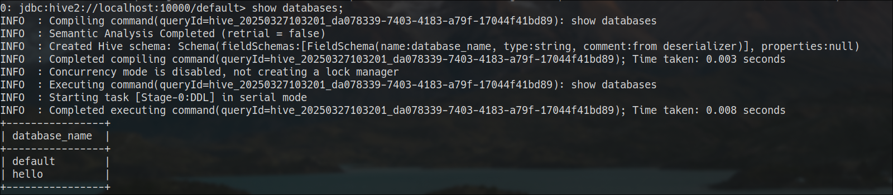
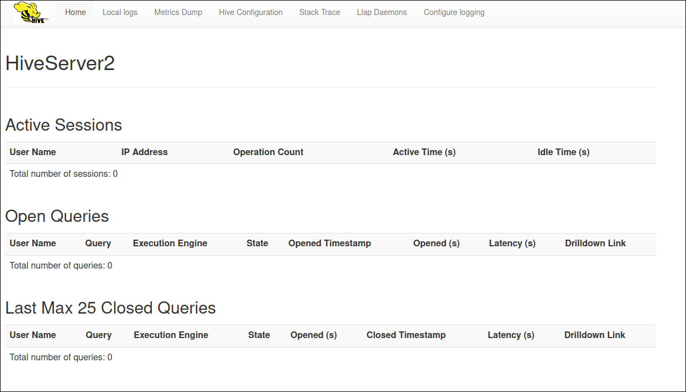

# Hive

Apache hive consist of two major component: HiveServer and Hive Metastore. HiveServer is sql engine which run on the hadoop ecosystem. HiveMetastore is a catalog which stores databases and tables information. 

## Hive Metastore
Metastore needs a relational database backend. I used an external (outside of Kubernetes cluster) postgresql server. The official Hive docker [image](https://hub.docker.com/r/apache/hive) doesn't contain postgresql driver. To overcome this issue we need to build a custom hive image.

### Docker Image
First, download required driver. If you want to use different relational database you should download related driver. You can find postgre and mysql driver in my repository.

```sh
curl -fLo files/postgres.jar https://repo1.maven.org/maven2/org/postgresql/postgresql/42.7.4/postgresql-42.7.4.jar
```

Create a Dockerfile like following. 

!!! tip
    `krb5-config` and `krb5-user` packages are optional. If you want to run kerberos client commands like `kinit`, `klist` inside the container, you should install these packages. Also we have created `hive` user home folder to avoid some errors.

=== "Dockerfile"
    ```docker
    FROM apache/hive:4.0.1
    COPY files/postgres.jar /opt/hive/lib/postgres.jar
    # Mysql: COPY files/mysql.jar /opt/hive/lib/mysql.jar

    USER root

    RUN apt-get update && \
    DEBIAN_FRONTEND=noninteractive apt-get -qq -y install krb5-config krb5-user

    RUN mkdir -p /home/hive
    RUN chown -R hive:hive /home/hive
    USER hive

    ```

Then build and push it
```sh
docker build -t kube5:30123/custom/hive:4.0.1 .
docker push kube5:30123/custom/hive:4.0.1
```
!!! tip
    You should use your own custom docker registry or docker hub account.


### Kerberos Settings
Hive needs following principal for kerberos authentication:

```bash
hive/metastore.company.bigdata.svc.cluster.local@HOMELDAP.ORG
```
You should create a keytab file for the principal. Then you should deploy it as Secret, you can use `ktutil` tool to create keytab. 

```bash
kubectl create -n bigdata secret generic keytab-hive --from-file=./files/hive.keytab
```
### HDFS Connection
Create required HDFS directories:
```bash
hdfs dfs -mkdir /tmp
hdfs dfs -mkdir /warehouse
hdfs dfs -mkdir /warehouse/external
hdfs dfs -mkdir /warehouse/managed
hdfs dfs -mkdir -p /opt/hive/scratch_dir # you can change this path in hive-site.xml

```
Set permission for these directories

```bash
hdfs dfs -chmod 777 /tmp
hdfs dfs -setfacl -R -m user:hive:rwx /warehouse
hdfs dfs -setfacl -R -m user:hive:rwx /opt/hive/scratch_dir
```

Add following configurations to Hadoop `core-site.xml`: 

```xml
...
   <property>
      <name>hadoop.proxyuser.hive.hosts</name>
      <value>*</value>
   </property>
   <property>
      <name>hadoop.proxyuser.hive.groups</name>
      <value>*</value>
   </property>
   <property>
      <name>hadoop.proxyuser.hive.users</name>
      <value>*</value>
   </property>
...
```
### Deployment

!!! tip
    As Hive Metastore is a stateless service, you can deploy it as a Deployment.

#### Configs

!!! tip
    Hive server requires YARN kerberos principal to set. Otherwise It returns *"Can't get Master Kerberos principal for use as renewer"* error.
    
    [https://stackoverflow.com/a/69068935/3648566](https://stackoverflow.com/a/69068935/3648566)
    
    [https://steveloughran.gitbooks.io/kerberos_and_hadoop/content/sections/errors.html](https://steveloughran.gitbooks.io/kerberos_and_hadoop/content/sections/errors.html)

=== "configs/hive-site.xml"
    ```xml
    <?xml version="1.0" encoding="UTF-8"?>
    <configuration>
      <property>
        <name>hive.metastore.uris</name>
        <value>thrift://metastore.company.bigdata.svc.cluster.local:9083</value>
      </property>
      <property>
        <name>hive.metastore.execute.setugi</name>
        <value>true</value>
      </property>
      <property>
        <name>hive.metastore.warehouse.dir</name>
        <value>/warehouse/managed</value>
      </property>
      <property>
        <name>hive.metastore.warehouse.external.dir</name>
        <value>/warehouse/external</value>
      </property>
      <property>
        <name>hive.metastore.event.db.notification.api.auth</name>
        <value>false</value>
      </property>
      <property>
        <name>hive.metastore.try.direct.sql.ddl</name>
        <value>true</value>
      </property>
      <property>
        <name>hive.metastore.try.direct.sql</name>
        <value>true</value>
      </property>
      <property>
        <name>hive.metastore.dml.events</name>
        <value>true</value>
      </property>
      <property>
        <name>hive.metastore.notification.add.thrift.object</name>
        <value>true</value>
      </property>
      <property>
        <name>hive.metastore.server.filter.enabled</name>
        <value>false</value>
      </property>
      <property>
        <name>hive.metastore.authorization.storage.checks</name>
        <value>false</value>
      </property>
      <property>
        <name>hive.server2.enable.doAs</name>
        <value>false</value>
      </property>
      <!-- Kerberos -->
      <property>
        <name>hive.metastore.sasl.enabled</name>
        <value>true</value>
      </property>
      <property>
        <name>hive.metastore.kerberos.keytab.file</name>
        <value>/etc/security/keytabs/hive.keytab</value>
      </property>
      <property>
        <name>hive.metastore.kerberos.principal</name>
        <value>hive/_HOST@HOMELDAP.ORG</value>
      </property>
      <property>
        <name>hive.server2.authentication</name>
        <value>KERBEROS</value>
      </property>
      <property>
        <name>hive.server2.authentication.kerberos.principal</name>
        <value>hive/_HOST@HOMELDAP.ORG</value>
      </property>
      <property>
        <name>hive.server2.authentication.kerberos.keytab</name>
        <value>/etc/security/keytabs/hiveserver.keytab</value>
      </property>
    </configuration>
    ```
=== "configs/yarn-site.xml"
    ```xml
    <?xml version="1.0" encoding="UTF-8"?>
    <configuration>
    <property>
        <name>yarn.resourcemanager.principal</name>
        <value>hdfs/_HOST@HOMELDAP.ORG</value>
      </property>
    </configuration>
    ```
Deploying configurations:
```bash
kubectl create configmap hive-site-config -n bigdata --from-file=hive-site.xml=./configs/hive-site.xml --from-file=yarn-site.xml=./configs/yarn-site.xml
```


#### Manifest file

=== "metastore.yaml"
```yaml
apiVersion: v1
kind: Pod
metadata:
  name: hive-metastore
  namespace: bigdata
  labels:
    name: hive-metastore
    app: hive-metastore
    dns: hdfs-subdomain
spec:
  hostname: metastore
  subdomain: company
  hostAliases:
  - ip: "192.168.1.52"
    hostnames:
    - "kdc.homeldap.org"
  containers:
  - name: hive-metastore
    image: kube5:30123/custom/hive:4.0.1
    imagePullPolicy: Always
    env:
    - name: SERVICE_OPTS
      value: "-Xmx1G -Djavax.jdo.option.ConnectionDriverName=org.postgresql.Driver -Djavax.jdo.option.ConnectionURL=jdbc:postgresql://192.168.122.18:5432/hive -Djavax.jdo.option.ConnectionUserName=root -Djavax.jdo.option.ConnectionPassword=142536"
    - name: SERVICE_NAME
      value: metastore
    - name: DB_DRIVER
      value: postgres
    - name: VERBOSE
      value: 'true'
    - name: HIVE_CUSTOM_CONF_DIR
      value: /hive-configs
    resources:
      limits:
        memory: "1G"
        cpu: "1000m"
    ports:
      - containerPort: 9083
    volumeMounts:
    - name: hive-site-config
      mountPath: /hive-configs/hive-site.xml
      subPath: hive-site.xml
    - name: hive-site-config
      mountPath: /hive-configs/yarn-site.xml
      subPath: yarn-site.xml
    - name: hadoop-config
      mountPath: /hive-configs/core-site.xml
      subPath: core-site.xml
    - name: hadoop-config
      mountPath: /hive-configs/hdfs-site.xml
      subPath: hdfs-site.xml
    - name: keytab-hive
      mountPath: /etc/security/keytabs/
    - name: krb5conf
      mountPath: /etc/krb5.conf
      subPath: krb5.conf
  volumes:
  - name: hive-site-config
    configMap:
      name: hive-site-config
  - name: hadoop-config
    configMap:
      name: hadoop-config
  - name: keytab-hive
    secret:
      secretName: keytab-hive
  - name: krb5conf
    configMap:
      name: krb5conf
---
apiVersion: v1
kind: Service
metadata:
  name: hive-metastore
  namespace: bigdata
spec:
  type: ClusterIP
  selector:
    app: hive-metastore
  ports:
  - port: 9083
    targetPort: 9083
```

Ensure that use same headless service named same as subdomain value:

```yaml
...
  labels:
    name: hive-metastore
    app: hive-metastore
    dns: hdfs-subdomain
spec:
  hostname: metastore
  subdomain: company
...
```

Set container image as our custom image that related sql driver included. Setting to `imagePullPolicy` as `Always` can be useful when testing the custom image.
```yaml
...
image: kube5:30123/custom/hive:4.0.1
imagePullPolicy: Always
...
```
Official hive images takes some environment variables. To set postgresql (or mysql) configurations we should set `SERVICE_OPTS` variable. 

```yaml 
- name: SERVICE_OPTS
  value: "-Xmx1G -Djavax.jdo.option.ConnectionDriverName=org.postgresql.Driver -Djavax.jdo.option.ConnectionURL=jdbc:postgresql://<database_host>:<database_port>/<database_name> -Djavax.jdo.option.ConnectionUserName=<database_user_name> -Djavax.jdo.option.ConnectionPassword=<database_password>"
- name: DB_DRIVER
  value: postgres
```
!!! tip
    We can set maximum heap memory using the `-Xmx1G` parameter.


While the `SERVICE_NAME` variable determines which hive service will run, the `HIVE_CUSTOM_CONF_DIR` variable determines the location of the configuration files.

```yaml
- name: SERVICE_NAME
  value: metastore
- name: HIVE_CUSTOM_CONF_DIR
  value: /hive-configs
```

We mount Hive configurations, `krb5.conf` and hive keytab file. Also for HDFS support we should mount HDFS configuration files. 
```yaml
...
    volumeMounts:
    - name: hive-site-config
      mountPath: /hive-configs/hive-site.xml
      subPath: hive-site.xml
    - name: hive-site-config
      mountPath: /hive-configs/yarn-site.xml
      subPath: yarn-site.xml
    - name: hadoop-config
      mountPath: /hive-configs/core-site.xml
      subPath: core-site.xml
    - name: hadoop-config
      mountPath: /hive-configs/hdfs-site.xml
      subPath: hdfs-site.xml
    - name: keytab-hive
      mountPath: /etc/security/keytabs/
    - name: krb5conf
      mountPath: /etc/krb5.conf
      subPath: krb5.conf
  volumes:
  - name: hive-site-config
    configMap:
      name: hive-site-config
  - name: hadoop-config
    configMap:
      name: hadoop-config
  - name: keytab-hive
    secret:
      secretName: keytab-hive
  - name: krb5conf
    configMap:
      name: krb5conf
...
```
Deploy hive metastore:
```bash
kubectl apply -f metastore.yaml
```

## Hive Server
I deployed minimal, not distributed, Hive Server. It is only to test and control metastore. 

Because we enable kerberos authentication for metastore, we need the following hive server keytab and kerberos settings:

```bash
hive/hiveserver.company.bigdata.svc.cluster.local@HOMELDAP.ORG
```
Deploy the hive server keytab as secret:
```yaml
kubectl create -n bigdata secret generic keytab-hive-server --from-file=./files/hiveserver.keytab
```
=== "hiveserver.yaml"
```yaml
apiVersion: v1
kind: Pod
metadata:
  name: hive-server
  namespace: bigdata
  labels:
    app: hive-server
    dns: hdfs-subdomain
spec:
  hostname: hiveserver
  subdomain: company
  containers:
  - name: hive-server
    image: kube5:30123/custom/hive:4.0.1
    imagePullPolicy: Always
    env:
    - name: SERVICE_NAME
      value: hiveserver2
    - name: HIVE_CUSTOM_CONF_DIR
      value: /hive-configs
    - name: SERVICE_OPTS
      value: "-Dhive.metastore.uris=thrift://metastore.company.bigdata.svc.cluster.local:9083"
    resources:
      limits:
        memory: "2G"
        cpu: "1000m"
    ports:
      - containerPort: 10000
      - containerPort: 10002
    volumeMounts:
    - name: hive-site-config
      mountPath: /hive-configs/hive-site.xml
      subPath: hive-site.xml
    - name: hive-site-config
      mountPath: /hive-configs/yarn-site.xml
      subPath: yarn-site.xml
    - name: hadoop-config
      mountPath: /hive-configs/core-site.xml
      subPath: core-site.xml
    - name: hadoop-config
      mountPath: /hive-configs/hdfs-site.xml
      subPath: hdfs-site.xml
    - name: keytab-hive-server
      mountPath: /etc/security/keytabs/
    - name: krb5conf
      mountPath: /etc/krb5.conf
      subPath: krb5.conf
  volumes:
  - name: hive-site-config
    configMap:
      name: hive-site-config
  - name: hadoop-config
    configMap:
      name: hadoop-config
  - name: keytab-hive-server
    secret:
      secretName: keytab-hive-server
  - name: krb5conf
    configMap:
      name: krb5conf
---
apiVersion: v1
kind: Service
metadata:
  name: hive-server-svc
  namespace: bigdata
spec:
  type: ClusterIP
  selector:
    app: hive-server
  ports:
  - port: 10000
    targetPort: 10000
---
apiVersion: v1
kind: Service
metadata:
  name: hive-server-np
  namespace: bigdata
spec:
  type: NodePort
  selector:
    app: hive-server
  ports:
  - port: 10000
    name: server
    targetPort: 10000
    nodePort: 31000
  - port: 10002
    name: webui
    targetPort: 10002
    nodePort: 31002
```

Set following parameters to run hive server:
```yaml
    - name: SERVICE_NAME
      value: hiveserver2
    - name: HIVE_CUSTOM_CONF_DIR
      value: /hive-configs
    - name: SERVICE_OPTS
      value: "-Dhive.metastore.uris=thrift://metastore.company.bigdata.svc.cluster.local:9083"
```
Additionaly we create a nodeport service, to access hive server web ui and hive server from outside of kubernetes cluster.

Deploy hive server:
```bash
kubectl apply -f hiveserver.yaml
```

To test our metastore first we should access hive server CLI:

```bash
kubectl -n bigdata exec -it hive-server -- bash
```
Then we should take kerberos ticket and connect to hive server using `beeline`: 

**kinit**:
```bash
kinit -kt /etc/security/keytabs/hiveserver.keytab hive/hiveserver.company.bigdata.svc.cluster.local@HOMELDAP.ORG
```
**beeline**:
```bash

beeline -u 'jdbc:hive2://localhost:10000/default;principal=hive/hiveserver.company.bigdata.svc.cluster.local@HOMELDAP.ORG'
```
Now you can run sql commands on hive server:



