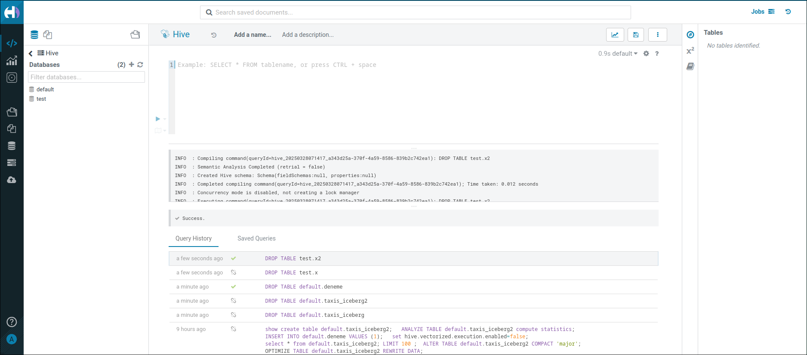
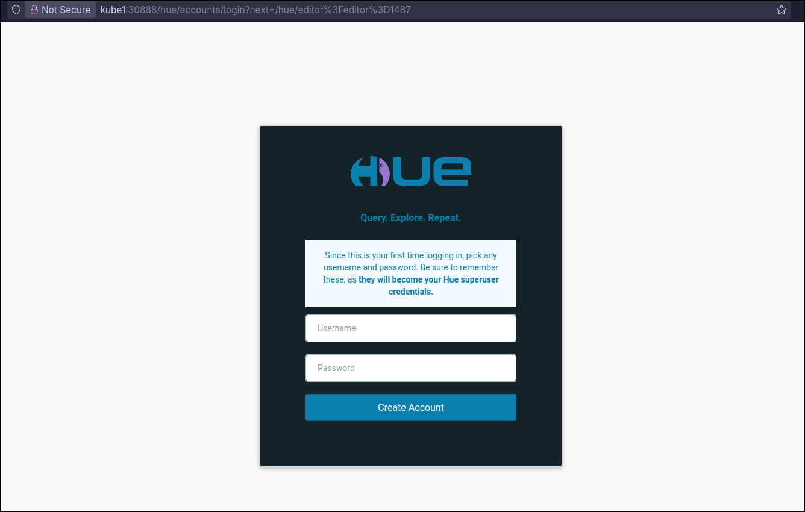
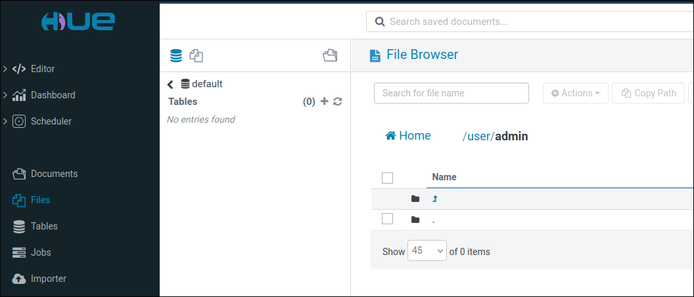
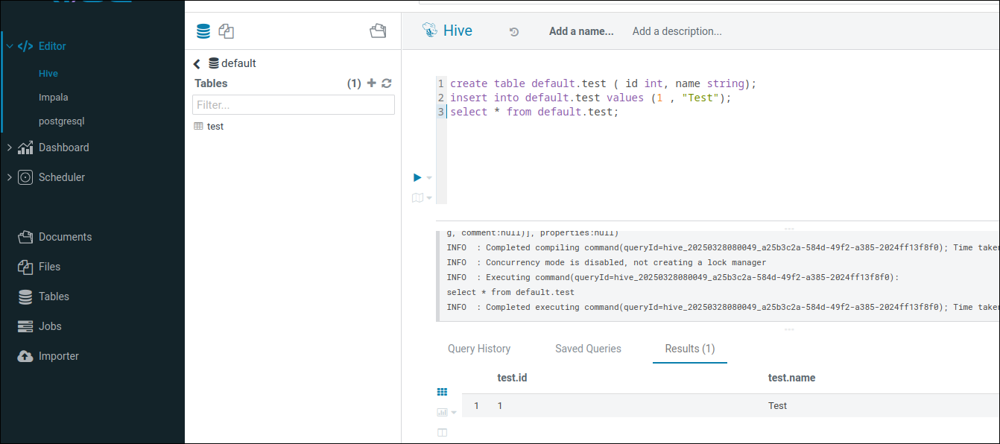
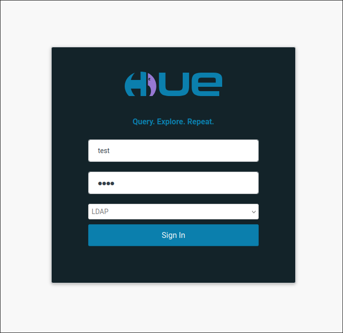

# Hue




Hue is a powerful tool for big data that allows users to run queries on different SQL engines and perform operations on HDFS directories. In addition to these capabilities, it offers many other features that enhance data exploration and management.  

## HELM Chart
Fortunately, hue releases official helm charts.

Download and extract the helm chart:
```
helm pull gethue/hue
tar -xvzf hue-1.0.3.tgz
mv hue chart
```

## Kerberos

We should create a principle for hue. Host FQDN is not required in principle.
```bash
hue@HOMELDAP.ORG
```

Deploy as secret:
```bash
kubectl create -n bigdata secret generic keytab-hue --from-file=./files/hue.keytab
```

## Configurations
We should create `values.yaml` to set helm chart configurations. Hue uses relational database. So we should set database parameters. Additionally, we set kerberos, HDFS, hive (beeswax) configurations.

=== "values.yaml"
```yaml
hue:
  replicas: 1
  database:
    create: false
    persist: false
    engine: "postgresql_psycopg2"
    host: "192.168.122.18" # Postgresql Host
    port: 5432 # Postgresql Port
    user: "root" # Postgresql User
    password: "142536" # Postgresql Password
    name: "hue" # You must create hue database before deployment
  ini: |
    [desktop]
      ssl_validate=false
      [[kerberos]]
      hue_keytab=/etc/security/keytabs/hue.keytab
      hue_principal=hue@HOMELDAP.ORG
      ccache_path=/tmp/krb5cc_1001
    [beeswax]
      # Host where HiveServer2 is running.
      # If Kerberos security is enabled, use fully-qualified domain name (FQDN).
      hive_server_host=hiveserver.company.bigdata.svc.cluster.local

      # Port where HiveServer2 Thrift server runs on.
      hive_server_port=10000
    [hadoop]
      [[hdfs_clusters]]
        [[[default]]]
        fs_defaultfs=hdfs://namenode.company.bigdata.svc.cluster.local:9000
        webhdfs_url=https://namenode.company.bigdata.svc.cluster.local:50470/webhdfs/v1
        security_enabled=True
        mechanism=GSSAPI

```

To mount kerberos related files we should do some modifications in helm chart.

=== "chart/templates/deployment-hue.yaml"
```yaml
...
        volumeMounts:
        - name: config-volume
          mountPath: /usr/share/hue/desktop/conf/z-hue.ini
          subPath: hue-ini
        - name: config-volume-extra
          mountPath: /usr/share/hue/desktop/conf/zz-hue.ini
          subPath: hue-ini
        # - name: hive-config-volume
        #   mountPath: /etc/hive/conf/hive-site.xml
        #   subPath: hive-site
          ## KERBEROS
        - name: hive-site-config
          mountPath: /etc/hive/conf/hive-site.xml
          subPath: hive-site.xml
        - name: krb5conf
          mountPath: /etc/krb5.conf
          subPath: krb5.conf
        - name: keytab-hue
          mountPath: /etc/security/keytabs/
        readinessProbe:
...

{{ end }}
      volumes:
        - name: config-volume
          configMap:
            name: hue-config
        - name: config-volume-extra
          configMap:
            name: hue-config-extra
        - name: hive-config-volume
          configMap:
            name: hive-config
        ## KERBEROS
        - name: hive-site-config
          configMap:
            name: hive-site-config
        - name: keytab-hue
          secret:
            secretName: keytab-hue
        - name: krb5conf
          configMap:
            name: krb5conf
{{ if .Values.balancer.enabled }}
...
```

Also we add kerberos and ldap DNS records:

=== "chart/templates/deployment-hue.yaml"
```yaml
...
{{ end }}
      hostAliases:
      - ip: "192.168.1.52"
        hostnames:
        - "kdc.homeldap.org"
        - "homeldap.org"
      containers:
      - name: hue
        image: {{ .Values.image.registry }}/hue:{{ .Values.image.tag }}
...
```
## Hadoop Proxy User/Impersonation

Proxy user configurations provides a superuser can submit jobs or access hdfs on behalf of another user. We should add following configuration  to Hadoop `core-site.xml`: 

```xml
...
   <property>
      <name>hadoop.proxyuser.hue.hosts</name>
      <value>*</value>
   </property>
   <property>
      <name>hadoop.proxyuser.hue.groups</name>
      <value>*</value>
   </property>
   <property>
      <name>hadoop.proxyuser.hue.users</name>
      <value>*</value>
   </property>
...
```

!!! tips
    - After the changes you should update hadoop ConfigMap. 
    - [proxyuser](https://hadoop.apache.org/docs/stable/hadoop-project-dist/hadoop-common/Superusers.html)

## Deploy Helm Chart
To install or update HELM chart run following commands:
```bash
helm install hue ./chart -n bigdata -f values.yaml # Install

helm upgrade hue ./chart -n bigdata -f values.yaml # Update

helm uninstall hue -n bigdata # Uninstall
```

The command returns the following output:
```bash
helm install hue ./chart -n bigdata -f values.yaml
NAME: hue
LAST DEPLOYED: Thu Mar 27 19:35:43 2025
NAMESPACE: bigdata
STATUS: deployed
REVISION: 1
TEST SUITE: None
NOTES:
Congratulations, you've launched the Hue SQL Editor for Data Warehouses!

To check the status of your installation run:

  helm list --filter hue


Get the recommended URL below and start executing queries:


  export WEB_HOST=$(kubectl get node -o jsonpath="{.items[0].metadata.name}")

  export WEB_PORT=$(kubectl get service hue-balancer -o jsonpath="{.spec.ports[*].nodePort}" --namespace bigdata)

  echo http://$WEB_HOST:$WEB_PORT
```

To access Hue Web UI URL, run following commands one by one:
```bash
export WEB_HOST=$(kubectl get node -o jsonpath="{.items[0].metadata.name}")
export WEB_PORT=$(kubectl get service hue-balancer -o jsonpath="{.spec.ports[*].nodePort}" --namespace bigdata)
echo http://$WEB_HOST:$WEB_PORT
```

Alternatively, If you want to access hue always same port, you can create a node port service:
```xml
apiVersion: v1
kind: Service
metadata:
  name: hue-np
  namespace: bigdata
spec:
  type: NodePort
  selector:
    pod: hue
  ports:
  - port: 8888
    targetPort: 8888
    nodePort: 30888
```
Hue wants to set administrator account password when first login:



You can access HDFS files using **Files** button on the left menu:

!!! tips
    Hue creates automatically user folder on HDFS `/user/` path



You can run hive queries using Hive editor:



## LDAP Login

To enable LDAP backend to login hue, you should add following settings to `values.yaml` below the `[desktop]` settings. 

```config
ini: |

    [desktop]
      ssl_validate=false
      [[kerberos]]
      hue_keytab=/etc/security/keytabs/hue.keytab
      hue_principal=hue@HOMELDAP.ORG
      ccache_path=/tmp/krb5cc_1001
      
      [[auth]]
      backend=desktop.auth.backend.LdapBackend, desktop.auth.backend.AllowFirstUserDjangoBackend

      [[ldap]]
      nt_domain=HOMELDAP.ORG
      ldap_url=ldap://HOMELDAP.ORG:389
      base_dn="ou=People,dc=homeldap,dc=org"
      bind_dn="uid=master,ou=People,dc=homeldap,dc=org"
      search_bind_authentication=false
      create_users_on_login=true

      [[[users]]]
      user_filter="objectclass=inetOrgPerson"
      user_name_attr="uid"

```
!!! warning
    Most probably, your LDAP server configurations will be different from mine. You can follow Hue LDAP guide for correct configurations [Hue ldap settings](https://docs.gethue.com/administrator/configuration/server/#ldap)

Then update HELM chart:
```bash
helm upgrade hue ./chart -n bigdata -f values.yaml
```
Hue adds LDAP option to login screen. Still you can use DjangoBackend users.



## Other Settings

Other settings you can follow Hue [server settings ](https://docs.gethue.com/administrator/configuration/server/) and [connector settings](https://docs.gethue.com/administrator/configuration/connectors/). 


## Links
- [https://docs.ezmeral.hpe.com/datafabric-customer-managed/73/Hue/ConfigureHuetouseKerberos.html](https://docs.ezmeral.hpe.com/datafabric-customer-managed/73/Hue/ConfigureHuetouseKerberos.html)
- [https://docs.ezmeral.hpe.com/datafabric-customer-managed/79/Hue/EnableSSLEncryption-HueAndHttpFS.html](https://docs.ezmeral.hpe.com/datafabric-customer-managed/79/Hue/EnableSSLEncryption-HueAndHttpFS.html)
- values.yaml reference, [https://github.com/cloudera/hue/blob/master/tools/kubernetes/helm/hue/values.yaml](https://github.com/cloudera/hue/blob/master/tools/kubernetes/helm/hue/values.yaml)