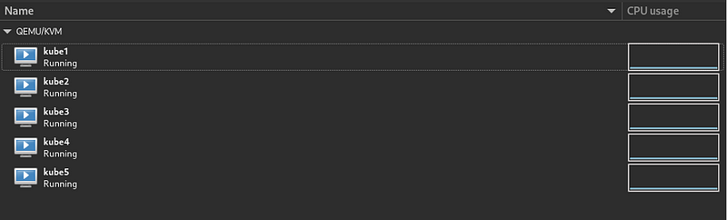
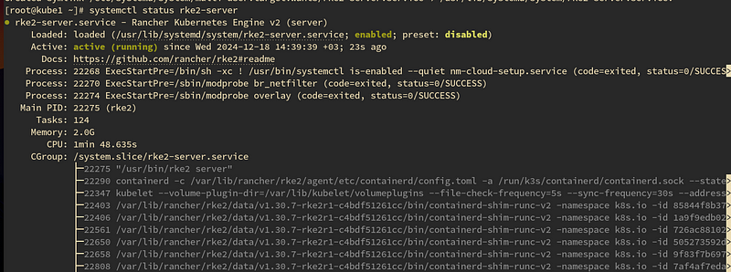
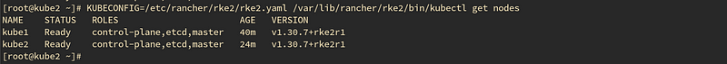
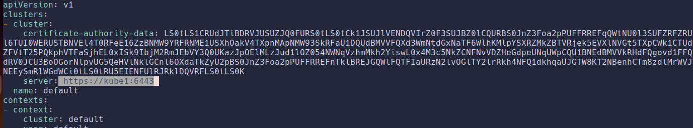
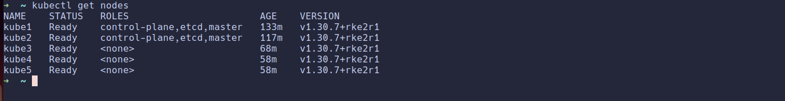
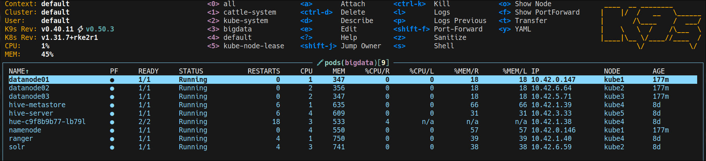
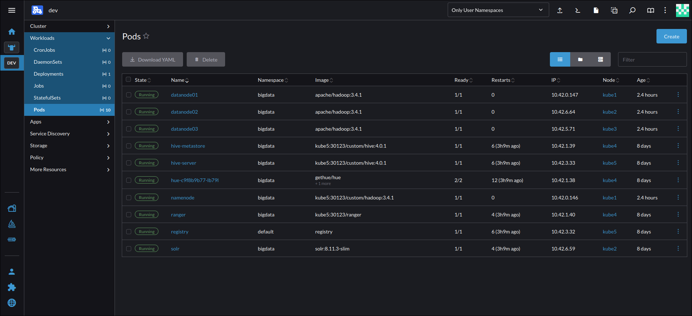

# Kubernetes Installation

!!! warning
    This guide is intended for testing and learning purposes only. It omits many details necessary for production environments. Do not use this setup in production.

## Kubernetes Nodes
For this cluster, I used five virtual machines (VMs): one master node and four worker nodes. In production environments, at least three master nodes are recommended for high availability. The VMs can have different configurations or sizes. I installed Rocky Linux 9.5 on all VMs, but any compatible Linux distribution can be used.

The host system runs Arch Linux with QEMU/KVM and Libvirt for virtualization. Below is an overview of the VMs:


Before proceeding with the installation, ensure your setup meets all prerequisites outlined in the [RKE2 Quick Start Guide](https://docs.rke2.io/install/quickstart#prerequisites).

Rocky Linux 9.5 satisfies most prerequisites by default. However, I had to disable the `firewalld` service and SELinux on all nodes:
```bash
systemctl disable --now firewalld
sudo sed -i 's/^SELINUX=.*/SELINUX=disabled/' /etc/selinux/config && sudo setenforce 0
```

Additionally, I updated the `/etc/hosts` file on all nodes and the host machine to simplify node communication. This step is optional but recommended. Below is an example of my `/etc/hosts` file:
```bash
192.168.1.61 kube1
192.168.1.62 kube2
192.168.1.63 kube3
192.168.1.64 kube4
192.168.1.65 kube5
```

## Rancher Kubernetes Engine (RKE2)
RKE2 is a production-grade Kubernetes distribution provided by Rancher. Also known as "RKE Government," it is designed for enhanced security and compliance, particularly for U.S. Federal Government use cases. For more details, refer to the [RKE2 documentation](https://docs.rke2.io).

### Setting Up the First Master Node
Master nodes run critical Kubernetes components such as etcd and the control plane. For high availability, at least three master nodes are recommended. However, for this testing setup, I used a single master node.

RKE2 provides an installation script that automatically checks your environment and installs the required packages.

!!! tip
    All commands in this guide should be run as a superuser.

To set up the first master node (e.g., `kube1`), download and execute the installation script:
```bash
curl -sfL https://get.rke2.io | sh -
```

Start the `rke2-server` service:
```bash
systemctl enable --now rke2-server.service
```

Verify the service status:
```bash
systemctl status rke2-server.service
```


### Setting Up Additional Master Nodes (Optional)
To add more master nodes, configure each new node to join the existing cluster. Before installation, create a configuration file on the new node (e.g., `kube2`):
```bash
mkdir -p /etc/rancher/rke2/
vim /etc/rancher/rke2/config.yaml
```

Add the following values to the `config.yaml` file:
```yaml
server: https://<server>:9345
token: <token from server node>
```
- `server`: The DNS name or IP address of the first master node.
- `token`: The cluster token, which can be retrieved from the first master node:
```bash
cat /var/lib/rancher/rke2/server/node-token
```

For example, my `config.yaml` file looks like this:
```yaml
server: https://kube1:9345
token: K1010d01bdaf32a792d9d233981959a757addaa6e8f6d622a68948467e495144155::server:af29acb6148c5132be664524a8822a76
```

Next, install RKE2 on the new master node:
```bash
curl -sfL https://get.rke2.io | sh -
```

Start the `rke2-server` service:
```bash
systemctl enable --now rke2-server.service
```

After a few minutes, the new master node should join the cluster. Verify the cluster status using the following command on any master node:
```bash
KUBECONFIG=/etc/rancher/rke2/rke2.yaml /var/lib/rancher/rke2/bin/kubectl get nodes
```

The output should display all nodes in the cluster:


You can add more master nodes using the same steps. For more details on distributing Kubernetes roles, refer to the [RKE2 server roles documentation](https://docs.rke2.io/install/server_roles).

### Worker Nodes
The process for setting up worker nodes is similar to adding additional master nodes, with one key difference: you must specify the worker node type.

First, create the `config.yaml` file on the worker node:
```bash
mkdir -p /etc/rancher/rke2/
vim /etc/rancher/rke2/config.yaml
```

Add the same `server` and `token` values as in the master node setup.

To install the worker node, run the following command:
```bash
curl -sfL https://get.rke2.io | INSTALL_RKE2_TYPE="agent" sh -
```

Start the `rke2-agent` service:
```bash
systemctl enable --now rke2-agent.service
```

Verify the worker node status from any master node:
```bash
KUBECONFIG=/etc/rancher/rke2/rke2.yaml /var/lib/rancher/rke2/bin/kubectl get nodes
```

Repeat these steps to add more worker nodes.

## Accessing the Kubernetes Cluster
Manually connecting to the master node for every Kubernetes CLI command can be inefficient. Instead, you can configure access to the cluster from your local machine.

First, install `kubectl` on your local machine by following the [official guide](https://kubernetes.io/docs/tasks/tools/).

Next, copy the `/etc/rancher/rke2/rke2.yaml` file from the master node to your local machine. Update the `server` address in the configuration file to the master node's IP address or DNS name (instead of `127.0.0.1` or `localhost`).

For example:


!!! warning
    Ensure that your local machine has network access to the master node. You may need to adjust firewall rules.

After updating the configuration, verify the connection:
```bash
kubectl get nodes
```

If successful, you should see a list of nodes in your cluster:


### Kubernetes Management
You can use various tools to manage your Kubernetes cluster. Some popular options include:

- **Rancher UI** [docker](https://ranchermanager.docs.rancher.com/getting-started/installation-and-upgrade/other-installation-methods/rancher-on-a-single-node-with-docker)
- **Portainer**
- **k9s** (a minimal TUI tool)

**k9s:**



**Rancher:**


## Extra: Custom Docker Registry
Some big data services require custom Docker images. To simplify this, you can deploy a custom Docker registry within your Kubernetes cluster.

Here’s an example configuration for a Docker registry running on the `kube5` node:

=== "registry.yaml"
  ```yaml
  apiVersion: v1
  kind: Pod
  metadata:
    name: registry
    namespace: default
    labels:
      app: registry
  spec:
    nodeSelector:
      kubernetes.io/hostname: "kube5"
    containers:
    - name: registry
      image: registry:latest
      ports:
        - containerPort: 5000
      volumeMounts:
      - name: registry-volume
        mountPath: /var/lib/registry
    volumes:
    - name: registry-volume
      hostPath:
        path: /data/registry
        type: Directory
  ---
  apiVersion: v1
  kind: Service
  metadata:
    name: registry-svc
    namespace: default
  spec:
    type: NodePort
    selector:
      app: registry
    ports:
    - port: 5000
      targetPort: 5000
      nodePort: 30123
  ```

Deploy the registry:
```bash
kubectl apply -f registry.yaml
```

For insecure registries, update the Docker or containerd configuration on all nodes. For example, on Docker:
```bash
{
    "insecure-registries": ["kube5:30123"]
}
```

Restart the Docker service:
```bash
sudo systemctl restart docker
```

For containerd (used by RKE2), create `/etc/rancher/rke2/registries.yaml`:
```yaml
mirrors:
  "kube5:30123":
    endpoint:
      - "http://kube5:30123"
```

Restart RKE2 services:

- Master Node:
```bash
systemctl restart rke2-server
```
- Worker Node:
```bash
systemctl restart rke2-agent
```

Now, all Kubernetes nodes can access the custom Docker registry.