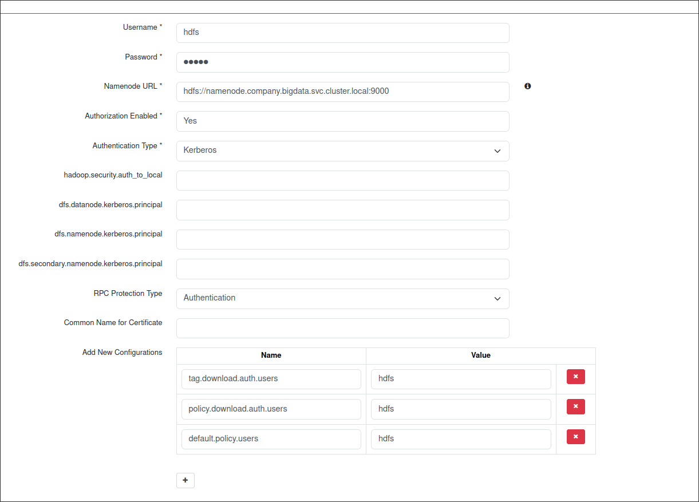
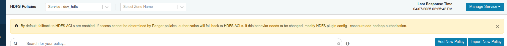
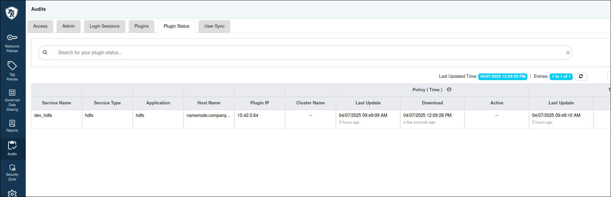
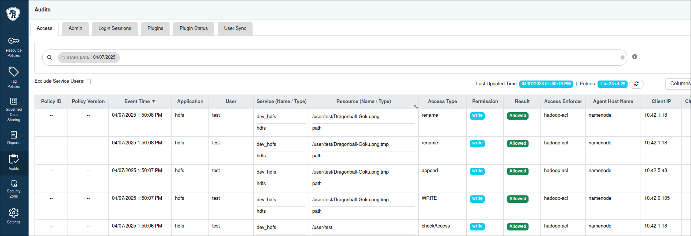
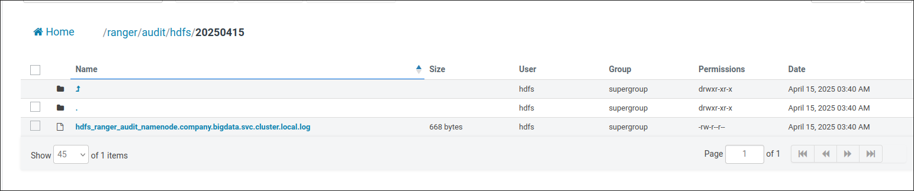
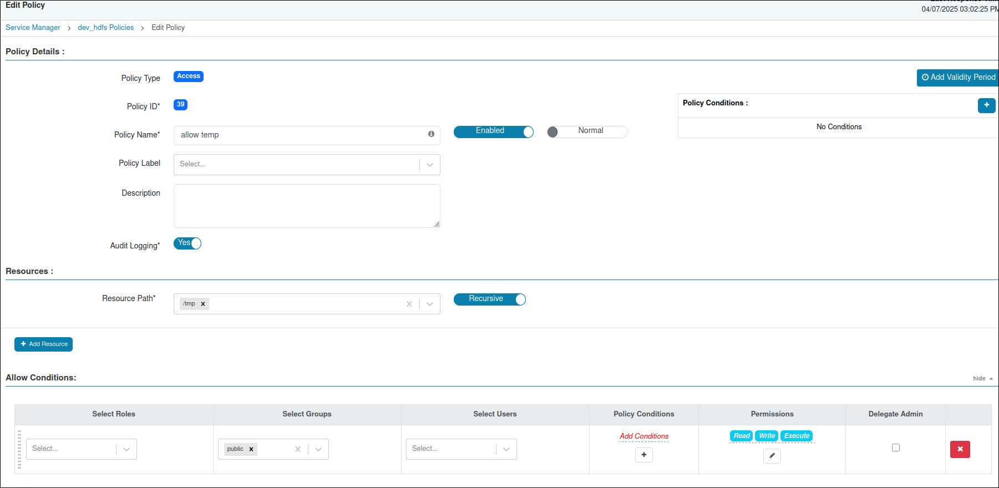
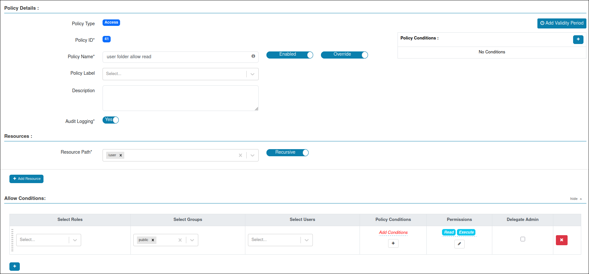
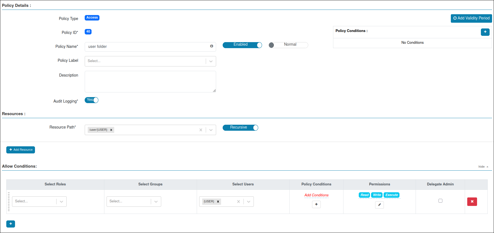
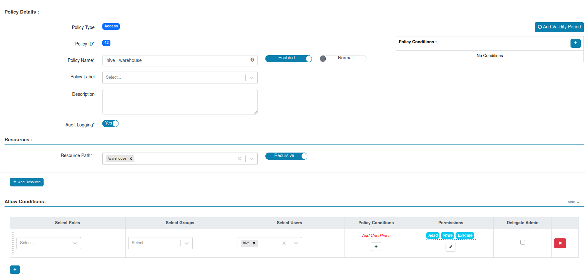
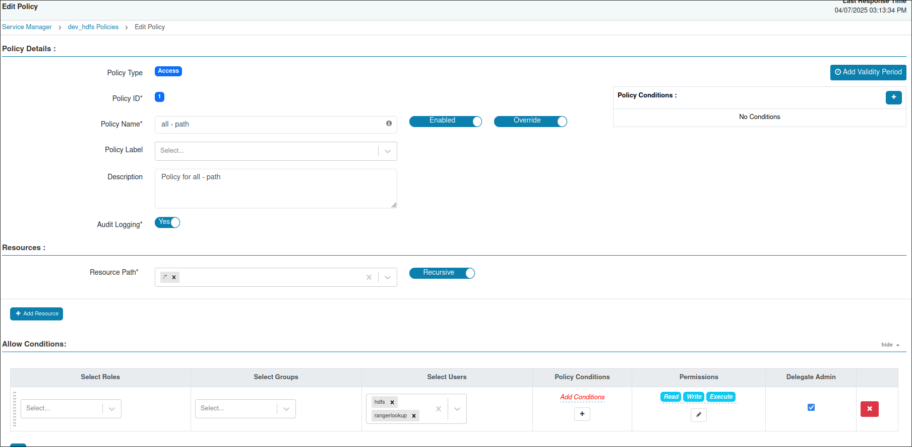

# HDFS Plugin

### Docker Image

Copy the `ranger-3.0.0-SNAPSHOT-hdfs-plugin.tar.gz` file into the `hdfs/files` directory.

=== "Dockerfile"
```dockerfile
FROM apache/hadoop:3.4.1

USER root
RUN mkdir /ranger
RUN chown hadoop:hadoop /ranger
RUN mkdir -p /etc/ranger
RUN chown -R hadoop:root /etc/ranger
RUN mkdir -p /var/log/hadoop/hdfs/audit/solr/spool
RUN chown -R hadoop:root /var/log/hadoop/hdfs/audit/solr/spool
USER hadoop
COPY files/ranger-3.0.0-SNAPSHOT-hdfs-plugin.tar.gz /ranger/ranger-3.0.0-SNAPSHOT-hdfs-plugin.tar.gz
WORKDIR /ranger
RUN tar -xvf /ranger/ranger-3.0.0-SNAPSHOT-hdfs-plugin.tar.gz
RUN chmod +x /ranger/ranger-3.0.0-SNAPSHOT-hdfs-plugin/enable-hdfs-plugin.sh

WORKDIR /opt/hadoop
USER root
```
This Dockerfile copies and extracts the plugin, then sets the necessary permissions.

Build and push docker image:
```bash
docker build -t kube5:30123/custom/hadoop:3.4.1 .
docker push kube5:30123/custom/hadoop:3.4.1 
```

### Plugin Configuration
Ranger HDFS plugin requires an `install.properties` file. A sample configuration is included in the plugin archive.

!!! warning
    Update following properties:
    
    - `POLICY_MGR_URL=http://ranger.company.bigdata.svc.cluster.local:6080`
    - `REPOSITORY_NAME=dev_hdfs`
    - `COMPONENT_INSTALL_DIR_NAME=/opt/hadoop/`
    - `XAAUDIT.SOLR.ENABLE=true`
    - `XAAUDIT.SOLR.URL=http://192.168.1.65:30983/solr/ranger_audits`
    - `XAAUDIT.HDFS.ENABLE=true`
    - `XAAUDIT.HDFS.HDFS_DIR=hdfs://namenode.company.bigdata.svc.cluster.local:9000/ranger/audit`

=== "install.properties"
```
# Licensed to the Apache Software Foundation (ASF) under one or more
# contributor license agreements.  See the NOTICE file distributed with
# this work for additional information regarding copyright ownership.
# The ASF licenses this file to You under the Apache License, Version 2.0
# (the "License"); you may not use this file except in compliance with
# the License.  You may obtain a copy of the License at
#
#     http://www.apache.org/licenses/LICENSE-2.0
#
# Unless required by applicable law or agreed to in writing, software
# distributed under the License is distributed on an "AS IS" BASIS,
# WITHOUT WARRANTIES OR CONDITIONS OF ANY KIND, either express or implied.
# See the License for the specific language governing permissions and
# limitations under the License.

#
# Location of Policy Manager URL  
#
# Example:
# POLICY_MGR_URL=http://policymanager.xasecure.net:6080
#
POLICY_MGR_URL=http://ranger.company.bigdata.svc.cluster.local:6080

#
# This is the repository name created within policy manager
#
# Example:
# REPOSITORY_NAME=hadoopdev
#
REPOSITORY_NAME=dev_hdfs
#
# Set hadoop home when hadoop program and Ranger HDFS Plugin are not in the
# same path.
#
COMPONENT_INSTALL_DIR_NAME=/opt/hadoop/

# AUDIT configuration with V3 properties
# Enable audit logs to Solr
#Example
#XAAUDIT.SOLR.ENABLE=true
#XAAUDIT.SOLR.URL=http://localhost:6083/solr/ranger_audits
#XAAUDIT.SOLR.ZOOKEEPER=
#XAAUDIT.SOLR.FILE_SPOOL_DIR=/var/log/hadoop/hdfs/audit/solr/spool

XAAUDIT.SOLR.ENABLE=true
XAAUDIT.SOLR.URL=http://192.168.1.65:30983/solr/ranger_audits
XAAUDIT.SOLR.USER=NONE
XAAUDIT.SOLR.PASSWORD=NONE
XAAUDIT.SOLR.ZOOKEEPER=NONE
XAAUDIT.SOLR.FILE_SPOOL_DIR=/var/log/hadoop/hdfs/audit/solr/spool

# Enable audit logs to ElasticSearch
#Example
#XAAUDIT.ELASTICSEARCH.ENABLE=true
#XAAUDIT.ELASTICSEARCH.URL=localhost
#XAAUDIT.ELASTICSEARCH.INDEX=audit

XAAUDIT.ELASTICSEARCH.ENABLE=false
XAAUDIT.ELASTICSEARCH.URL=NONE
XAAUDIT.ELASTICSEARCH.USER=NONE
XAAUDIT.ELASTICSEARCH.PASSWORD=NONE
XAAUDIT.ELASTICSEARCH.INDEX=NONE
XAAUDIT.ELASTICSEARCH.PORT=NONE
XAAUDIT.ELASTICSEARCH.PROTOCOL=NONE

# Enable audit logs to HDFS
#Example
#XAAUDIT.HDFS.ENABLE=true
#XAAUDIT.HDFS.HDFS_DIR=hdfs://node-1.example.com:8020/ranger/audit
#XAAUDIT.HDFS.FILE_SPOOL_DIR=/var/log/hadoop/hdfs/audit/hdfs/spool
#  If using Azure Blob Storage
#XAAUDIT.HDFS.HDFS_DIR=wasb[s]://<containername>@<accountname>.blob.core.windows.net/<path>
#XAAUDIT.HDFS.HDFS_DIR=wasb://ranger_audit_container@my-azure-account.blob.core.windows.net/ranger/audit

XAAUDIT.HDFS.ENABLE=true
XAAUDIT.HDFS.HDFS_DIR=hdfs://namenode.company.bigdata.svc.cluster.local:9000/ranger/audit
XAAUDIT.HDFS.FILE_SPOOL_DIR=/var/log/hadoop/hdfs/audit/hdfs/spool

# Following additional propertis are needed When auditing to Azure Blob Storage via HDFS
# Get these values from your /etc/hadoop/conf/core-site.xml
#XAAUDIT.HDFS.HDFS_DIR=wasb[s]://<containername>@<accountname>.blob.core.windows.net/<path>
XAAUDIT.HDFS.AZURE_ACCOUNTNAME=__REPLACE_AZURE_ACCOUNT_NAME
XAAUDIT.HDFS.AZURE_ACCOUNTKEY=__REPLACE_AZURE_ACCOUNT_KEY
XAAUDIT.HDFS.AZURE_SHELL_KEY_PROVIDER=__REPLACE_AZURE_SHELL_KEY_PROVIDER
XAAUDIT.HDFS.AZURE_ACCOUNTKEY_PROVIDER=__REPLACE_AZURE_ACCOUNT_KEY_PROVIDER

#Log4j Audit Provider
XAAUDIT.LOG4J.ENABLE=false
XAAUDIT.LOG4J.IS_ASYNC=false
XAAUDIT.LOG4J.ASYNC.MAX.QUEUE.SIZE=10240
XAAUDIT.LOG4J.ASYNC.MAX.FLUSH.INTERVAL.MS=30000
XAAUDIT.LOG4J.DESTINATION.LOG4J=true
XAAUDIT.LOG4J.DESTINATION.LOG4J.LOGGER=xaaudit

# Enable audit logs to Amazon CloudWatch Logs
#Example
#XAAUDIT.AMAZON_CLOUDWATCH.ENABLE=true
#XAAUDIT.AMAZON_CLOUDWATCH.LOG_GROUP=ranger_audits
#XAAUDIT.AMAZON_CLOUDWATCH.LOG_STREAM={instance_id}
#XAAUDIT.AMAZON_CLOUDWATCH.FILE_SPOOL_DIR=/var/log/hive/audit/amazon_cloudwatch/spool

XAAUDIT.AMAZON_CLOUDWATCH.ENABLE=false
XAAUDIT.AMAZON_CLOUDWATCH.LOG_GROUP=NONE
XAAUDIT.AMAZON_CLOUDWATCH.LOG_STREAM_PREFIX=NONE
XAAUDIT.AMAZON_CLOUDWATCH.FILE_SPOOL_DIR=NONE
XAAUDIT.AMAZON_CLOUDWATCH.REGION=NONE

# End of V3 properties

#
#  Audit to HDFS Configuration
#
# If XAAUDIT.HDFS.IS_ENABLED is set to true, please replace tokens
# that start with __REPLACE__ with appropriate values
#  XAAUDIT.HDFS.IS_ENABLED=true
#  XAAUDIT.HDFS.DESTINATION_DIRECTORY=hdfs://__REPLACE__NAME_NODE_HOST:8020/ranger/audit/%app-type%/%time:yyyyMMdd%
#  XAAUDIT.HDFS.LOCAL_BUFFER_DIRECTORY=__REPLACE__LOG_DIR/hadoop/%app-type%/audit
#  XAAUDIT.HDFS.LOCAL_ARCHIVE_DIRECTORY=__REPLACE__LOG_DIR/hadoop/%app-type%/audit/archive
#
# Example:
#  XAAUDIT.HDFS.IS_ENABLED=true
#  XAAUDIT.HDFS.DESTINATION_DIRECTORY=hdfs://namenode.example.com:8020/ranger/audit/%app-type%/%time:yyyyMMdd%
#  XAAUDIT.HDFS.LOCAL_BUFFER_DIRECTORY=/var/log/hadoop/%app-type%/audit
#  XAAUDIT.HDFS.LOCAL_ARCHIVE_DIRECTORY=/var/log/hadoop/%app-type%/audit/archive
#
XAAUDIT.HDFS.IS_ENABLED=false
XAAUDIT.HDFS.DESTINATION_DIRECTORY=hdfs://__REPLACE__NAME_NODE_HOST:8020/ranger/audit/%app-type%/%time:yyyyMMdd%
XAAUDIT.HDFS.LOCAL_BUFFER_DIRECTORY=__REPLACE__LOG_DIR/hadoop/%app-type%/audit
XAAUDIT.HDFS.LOCAL_ARCHIVE_DIRECTORY=__REPLACE__LOG_DIR/hadoop/%app-type%/audit/archive

XAAUDIT.HDFS.DESTINTATION_FILE=%hostname%-audit.log
XAAUDIT.HDFS.DESTINTATION_FLUSH_INTERVAL_SECONDS=900
XAAUDIT.HDFS.DESTINTATION_ROLLOVER_INTERVAL_SECONDS=86400
XAAUDIT.HDFS.DESTINTATION_OPEN_RETRY_INTERVAL_SECONDS=60
XAAUDIT.HDFS.LOCAL_BUFFER_FILE=%time:yyyyMMdd-HHmm.ss%.log
XAAUDIT.HDFS.LOCAL_BUFFER_FLUSH_INTERVAL_SECONDS=60
XAAUDIT.HDFS.LOCAL_BUFFER_ROLLOVER_INTERVAL_SECONDS=600
XAAUDIT.HDFS.LOCAL_ARCHIVE_MAX_FILE_COUNT=10

#Solr Audit Provider
XAAUDIT.SOLR.IS_ENABLED=false
XAAUDIT.SOLR.MAX_QUEUE_SIZE=1
XAAUDIT.SOLR.MAX_FLUSH_INTERVAL_MS=1000
XAAUDIT.SOLR.SOLR_URL=http://192.168.1.65:30983/solr/ranger_audits

# End of V2 properties

#
# SSL Client Certificate Information
#
# Example:
# SSL_KEYSTORE_FILE_PATH=/etc/hadoop/conf/ranger-plugin-keystore.jks
# SSL_KEYSTORE_PASSWORD=none
# SSL_TRUSTSTORE_FILE_PATH=/etc/hadoop/conf/ranger-plugin-truststore.jks
# SSL_TRUSTSTORE_PASSWORD=none
#
# You do not need use SSL between agent and security admin tool, please leave these sample value as it is.
#
SSL_KEYSTORE_FILE_PATH=/etc/hadoop/conf/ranger-plugin-keystore.jks
SSL_KEYSTORE_PASSWORD=myKeyFilePassword
SSL_TRUSTSTORE_FILE_PATH=/etc/hadoop/conf/ranger-plugin-truststore.jks
SSL_TRUSTSTORE_PASSWORD=changeit

#
# Custom component user
# CUSTOM_COMPONENT_USER=<custom-user>
# keep blank if component user is default
CUSTOM_USER=hdfs


#
# Custom component group
# CUSTOM_COMPONENT_GROUP=<custom-group>
# keep blank if component group is default
CUSTOM_GROUP=hadoop
```

!!! tip
    Ensure `XAAUDIT.SOLR.URL` is accessible from outside Kubernetes for audit logs.

Create a ConfigMap for the plugin configuration:
```bash
kubectl create configmap hdfs-ranger-config -n bigdata --from-file=install.properties=./files/install.properties
```
### Updating the Ranger Service

In the Ranger UI, update the `dev_hdfs` service settings. 

!!! warning
    Ensure the following configurations are set:

    - `tag.download.auth.users`
    - `policy.download.auth.users`
    - `default.policy.users`

    Without these, the plugin will fail to download policies from the Ranger Admin.



### Disable Hadoop ACLS (Optional)



By default, Ranger falls back to Hadoop ACLs if no policy matches. To disable this behavior, update the `ranger-hdfs-security.xml` file:

```xml
...
  <property>
		<name>xasecure.add-hadoop-authorization</name>
		<value>false</value>
		<description>
			Enable/Disable the default hadoop authorization (based on
			rwxrwxrwx permission on the resource) if Ranger Authorization fails.
		</description>
	</property>
...
```
Redeploy the ConfigMap:
```bash
kubectl delete configmap hdfs-ranger-config -n bigdata 
kubectl create configmap hdfs-ranger-config -n bigdata --from-file=install.properties=./files/install.properties --from-file=ranger-hdfs-security.xml=./files/ranger-hdfs-security.xml
```
### HDFS Configuration

Modify the `namenode.yaml` manifest to run the `enable-hdfs-plugin.sh` script as root. Since the Docker image runs as root, use the `runuser` command to start the NameNode as the `hadoop` user. Also, mount the `hdfs-ranger-config` ConfigMap.

```yaml
...
    image: kube5:30123/custom/hadoop:3.4.1
    command: ["/bin/bash", "-c"]
    args:
    - | 
      /ranger/ranger-3.0.0-SNAPSHOT-hdfs-plugin/enable-hdfs-plugin.sh
      if [ ! -d "/hadoop/nn/current" ]; then
          runuser -u hadoop -- hdfs namenode -format -force
      fi
      runuser -u hadoop -- hdfs namenode

    resources:
...

volumeMounts:
...
    - name: hdfs-ranger-config
      mountPath: /ranger/ranger-3.0.0-SNAPSHOT-hdfs-plugin/install.properties
      subPath: install.properties
    - name: hdfs-ranger-config
      mountPath: /ranger/ranger-3.0.0-SNAPSHOT-hdfs-plugin/install/conf.templates/enable/ranger-hdfs-security.xml
      subPath: ranger-hdfs-security.xml
  volumes:
...
  - name: hdfs-ranger-config
    configMap:
      name: hdfs-ranger-config
...
```
Add the following property to `hdfs-site.xml` to enable the Ranger HDFS Authorizer:
```xml
...
    <property>
        <name>dfs.namenode.inode.attributes.provider.class</name>
        <value>org.apache.ranger.authorization.hadoop.RangerHdfsAuthorizer</value>
    </property>
...
```
## Verifying the Plugin

Once the plugin is successfully started, its status will appear in the Ranger UI under the **Plugin Status** page:



Audit logs will also be visible in the Ranger Audit section and also HDFS:






## Example HDFS Policies

Here are some sample policies you can configure in Ranger:

- **`/tmp` Path Permissions**  
  

- **`/user` Path Permissions**  
    
  

- **`hive` User Access to `warehouse`**  
  

- **`rangerlookup` Permissions**  
  
