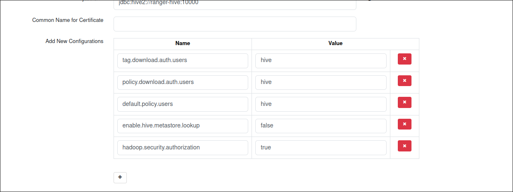
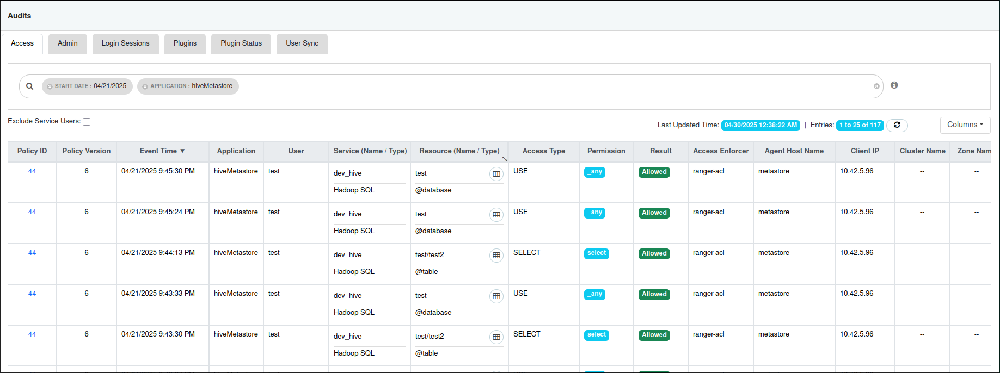
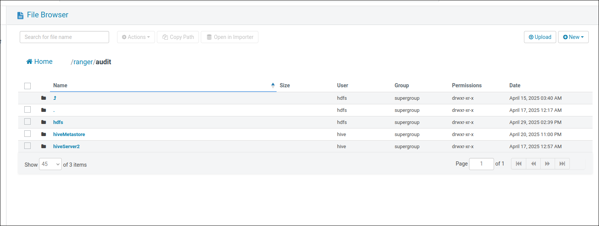

# Hive Plugin

### Docker Image

Copy the `ranger-3.0.0-SNAPSHOT-hive-plugin.tar.gz` file into the `hive/files` directory.

=== "Dockerfile"
```dockerfile
FROM apache/hive:4.0.1

COPY files/postgres.jar /opt/hive/lib/postgres.jar
# Mysql: COPY files/mysql.jar /opt/hive/lib/mysql.jar

USER root

RUN apt-get update && \
DEBIAN_FRONTEND=noninteractive apt-get -qq -y install krb5-config krb5-user

RUN mkdir -p /home/hive
RUN chown -R hive:hive /home/hive

RUN mkdir /ranger
RUN chown hive:hive /ranger
USER hive
COPY files/ranger-3.0.0-SNAPSHOT-hive-plugin.tar.gz /ranger/ranger-3.0.0-SNAPSHOT-hive-plugin.tar.gz
WORKDIR /ranger

RUN tar -xvf /ranger/ranger-3.0.0-SNAPSHOT-hive-plugin.tar.gz
RUN chmod +x /ranger/ranger-3.0.0-SNAPSHOT-hive-plugin/enable-hive-plugin.sh

RUN mkdir -p /var/log/hive/audit/solr/spool
RUN chown -R hive:root /var/log/hive/audit/solr/spool
WORKDIR /opt/hive

USER root

```
This Dockerfile copies and extracts the plugin, then sets the necessary permissions.

Build and push docker image:
```bash
docker build -t kube5:30123/custom/hive:4.0.1 .
docker push kube5:30123/custom/hive:4.0.1
```
### Plugin Configuration
Ranger Hive plugin requires an `install.properties` file. A sample configuration is included in the plugin archive.

!!! warning
    Update following properties:
    
    - `POLICY_MGR_URL=http://ranger.company.bigdata.svc.cluster.local:6080`
    - `REPOSITORY_NAME=dev_hive`
    - `COMPONENT_INSTALL_DIR_NAME=/opt/hive`
    - `XAAUDIT.SOLR.ENABLE=true`
    - `XAAUDIT.SOLR.URL=http://192.168.1.65:30983/solr/ranger_audits`
    - `XAAUDIT.HDFS.ENABLE=true`
    - `XAAUDIT.HDFS.HDFS_DIR=hdfs://namenode.company.bigdata.svc.cluster.local:9000/ranger/audit`

=== "install.properties"
```
# Licensed to the Apache Software Foundation (ASF) under one or more
# contributor license agreements.  See the NOTICE file distributed with
# this work for additional information regarding copyright ownership.
# The ASF licenses this file to You under the Apache License, Version 2.0
# (the "License"); you may not use this file except in compliance with
# the License.  You may obtain a copy of the License at
#
#     http://www.apache.org/licenses/LICENSE-2.0
#
# Unless required by applicable law or agreed to in writing, software
# distributed under the License is distributed on an "AS IS" BASIS,
# WITHOUT WARRANTIES OR CONDITIONS OF ANY KIND, either express or implied.
# See the License for the specific language governing permissions and
# limitations under the License.

#
# Location of Policy Manager URL  
#
# Example:
# POLICY_MGR_URL=http://policymanager.xasecure.net:6080
#
POLICY_MGR_URL=http://ranger.company.bigdata.svc.cluster.local:6080

#
# This is the repository name created within policy manager
#
# Example:
# REPOSITORY_NAME=hivedev
#
REPOSITORY_NAME=dev_hive

#
# Hive installation directory
#
# Example:
# COMPONENT_INSTALL_DIR_NAME=/var/local/apache-hive-2.1.0-bin
#
COMPONENT_INSTALL_DIR_NAME=/opt/hive

# AUDIT configuration with V3 properties

# Enable audit logs to Solr
#Example
#XAAUDIT.SOLR.ENABLE=true
#XAAUDIT.SOLR.URL=http://localhost:6083/solr/ranger_audits
#XAAUDIT.SOLR.ZOOKEEPER=
#XAAUDIT.SOLR.FILE_SPOOL_DIR=/var/log/hive/audit/solr/spool

XAAUDIT.SOLR.ENABLE=true
XAAUDIT.SOLR.URL=http://192.168.1.65:30983/solr/ranger_audits
XAAUDIT.SOLR.USER=NONE
XAAUDIT.SOLR.PASSWORD=NONE
XAAUDIT.SOLR.ZOOKEEPER=NONE
XAAUDIT.SOLR.FILE_SPOOL_DIR=/var/log/hive/audit/solr/spool

# Enable audit logs to ElasticSearch
#Example
#XAAUDIT.ELASTICSEARCH.ENABLE=true
#XAAUDIT.ELASTICSEARCH.URL=localhost
#XAAUDIT.ELASTICSEARCH.INDEX=audit

XAAUDIT.ELASTICSEARCH.ENABLE=false
XAAUDIT.ELASTICSEARCH.URL=NONE
XAAUDIT.ELASTICSEARCH.USER=NONE
XAAUDIT.ELASTICSEARCH.PASSWORD=NONE
XAAUDIT.ELASTICSEARCH.INDEX=NONE
XAAUDIT.ELASTICSEARCH.PORT=NONE
XAAUDIT.ELASTICSEARCH.PROTOCOL=NONE

# Enable audit logs to HDFS
#Example
#XAAUDIT.HDFS.ENABLE=true
#XAAUDIT.HDFS.HDFS_DIR=hdfs://node-1.example.com:8020/ranger/audit
#  If using Azure Blob Storage
#XAAUDIT.HDFS.HDFS_DIR=wasb[s]://<containername>@<accountname>.blob.core.windows.net/<path>
#XAAUDIT.HDFS.HDFS_DIR=wasb://ranger_audit_container@my-azure-account.blob.core.windows.net/ranger/audit
#XAAUDIT.HDFS.FILE_SPOOL_DIR=/var/log/hive/audit/hdfs/spool

XAAUDIT.HDFS.ENABLE=true
XAAUDIT.HDFS.HDFS_DIR=hdfs://namenode.company.bigdata.svc.cluster.local:9000/ranger/audit
XAAUDIT.HDFS.FILE_SPOOL_DIR=/var/log/hive/audit/hdfs/spool

# Following additional propertis are needed When auditing to Azure Blob Storage via HDFS
# Get these values from your /etc/hadoop/conf/core-site.xml
#XAAUDIT.HDFS.HDFS_DIR=wasb[s]://<containername>@<accountname>.blob.core.windows.net/<path>
XAAUDIT.HDFS.AZURE_ACCOUNTNAME=__REPLACE_AZURE_ACCOUNT_NAME
XAAUDIT.HDFS.AZURE_ACCOUNTKEY=__REPLACE_AZURE_ACCOUNT_KEY
XAAUDIT.HDFS.AZURE_SHELL_KEY_PROVIDER=__REPLACE_AZURE_SHELL_KEY_PROVIDER
XAAUDIT.HDFS.AZURE_ACCOUNTKEY_PROVIDER=__REPLACE_AZURE_ACCOUNT_KEY_PROVIDER

#Log4j Audit Provider
XAAUDIT.LOG4J.ENABLE=false
XAAUDIT.LOG4J.IS_ASYNC=false
XAAUDIT.LOG4J.ASYNC.MAX.QUEUE.SIZE=10240
XAAUDIT.LOG4J.ASYNC.MAX.FLUSH.INTERVAL.MS=30000
XAAUDIT.LOG4J.DESTINATION.LOG4J=true
XAAUDIT.LOG4J.DESTINATION.LOG4J.LOGGER=xaaudit

# Enable audit logs to Amazon CloudWatch Logs
#Example
#XAAUDIT.AMAZON_CLOUDWATCH.ENABLE=true
#XAAUDIT.AMAZON_CLOUDWATCH.LOG_GROUP=ranger_audits
#XAAUDIT.AMAZON_CLOUDWATCH.LOG_STREAM={instance_id}
#XAAUDIT.AMAZON_CLOUDWATCH.FILE_SPOOL_DIR=/var/log/hive/audit/amazon_cloudwatch/spool

XAAUDIT.AMAZON_CLOUDWATCH.ENABLE=false
XAAUDIT.AMAZON_CLOUDWATCH.LOG_GROUP=NONE
XAAUDIT.AMAZON_CLOUDWATCH.LOG_STREAM_PREFIX=NONE
XAAUDIT.AMAZON_CLOUDWATCH.FILE_SPOOL_DIR=NONE
XAAUDIT.AMAZON_CLOUDWATCH.REGION=NONE

# End of V3 properties


#
#  Audit to HDFS Configuration
#
# If XAAUDIT.HDFS.IS_ENABLED is set to true, please replace tokens
# that start with __REPLACE__ with appropriate values
#  XAAUDIT.HDFS.IS_ENABLED=true
#  XAAUDIT.HDFS.DESTINATION_DIRECTORY=hdfs://__REPLACE__NAME_NODE_HOST:8020/ranger/audit/%app-type%/%time:yyyyMMdd%
#  XAAUDIT.HDFS.LOCAL_BUFFER_DIRECTORY=__REPLACE__LOG_DIR/hive/audit/%app-type%
#  XAAUDIT.HDFS.LOCAL_ARCHIVE_DIRECTORY=__REPLACE__LOG_DIR/hive/audit/archive/%app-type%
#
# Example:
#  XAAUDIT.HDFS.IS_ENABLED=true
#  XAAUDIT.HDFS.DESTINATION_DIRECTORY=hdfs://namenode.example.com:8020/ranger/audit/%app-type%/%time:yyyyMMdd%
#  XAAUDIT.HDFS.LOCAL_BUFFER_DIRECTORY=/var/log/hive/audit/%app-type%
#  XAAUDIT.HDFS.LOCAL_ARCHIVE_DIRECTORY=/var/log/hive/audit/archive/%app-type%
#
XAAUDIT.HDFS.IS_ENABLED=false
XAAUDIT.HDFS.DESTINATION_DIRECTORY=hdfs://__REPLACE__NAME_NODE_HOST:8020/ranger/audit/%app-type%/%time:yyyyMMdd%
XAAUDIT.HDFS.LOCAL_BUFFER_DIRECTORY=__REPLACE__LOG_DIR/hive/audit/%app-type%
XAAUDIT.HDFS.LOCAL_ARCHIVE_DIRECTORY=__REPLACE__LOG_DIR/hive/audit/archive/%app-type%

XAAUDIT.HDFS.DESTINTATION_FILE=%hostname%-audit.log
XAAUDIT.HDFS.DESTINTATION_FLUSH_INTERVAL_SECONDS=900
XAAUDIT.HDFS.DESTINTATION_ROLLOVER_INTERVAL_SECONDS=86400
XAAUDIT.HDFS.DESTINTATION_OPEN_RETRY_INTERVAL_SECONDS=60
XAAUDIT.HDFS.LOCAL_BUFFER_FILE=%time:yyyyMMdd-HHmm.ss%.log
XAAUDIT.HDFS.LOCAL_BUFFER_FLUSH_INTERVAL_SECONDS=60
XAAUDIT.HDFS.LOCAL_BUFFER_ROLLOVER_INTERVAL_SECONDS=600
XAAUDIT.HDFS.LOCAL_ARCHIVE_MAX_FILE_COUNT=10

#Solr Audit Provider
XAAUDIT.SOLR.IS_ENABLED=false
XAAUDIT.SOLR.MAX_QUEUE_SIZE=1
XAAUDIT.SOLR.MAX_FLUSH_INTERVAL_MS=1000
XAAUDIT.SOLR.SOLR_URL=http://192.168.1.65:30983/solr/ranger_audits

# End of V2 properties

#
# SSL Client Certificate Information
#
# Example:
# SSL_KEYSTORE_FILE_PATH=/etc/hive/conf/ranger-plugin-keystore.jks
# SSL_KEYSTORE_PASSWORD=none
# SSL_TRUSTSTORE_FILE_PATH=/etc/hive/conf/ranger-plugin-truststore.jks
# SSL_TRUSTSTORE_PASSWORD=none
#
# You do not need use SSL between agent and security admin tool, please leave these sample value as it is.
#
SSL_KEYSTORE_FILE_PATH=/etc/hive/conf/ranger-plugin-keystore.jks
SSL_KEYSTORE_PASSWORD=myKeyFilePassword
SSL_TRUSTSTORE_FILE_PATH=/etc/hive/conf/ranger-plugin-truststore.jks
SSL_TRUSTSTORE_PASSWORD=changeit

#
# Should Hive GRANT/REVOKE update XA policies?
#
# Example:
#     UPDATE_XAPOLICIES_ON_GRANT_REVOKE=true
#     UPDATE_XAPOLICIES_ON_GRANT_REVOKE=false
#
UPDATE_XAPOLICIES_ON_GRANT_REVOKE=true

#
# Custom component user
# CUSTOM_COMPONENT_USER=<custom-user>
# keep blank if component user is default
CUSTOM_USER=hive


#
# Custom component group
# CUSTOM_COMPONENT_GROUP=<custom-group>
# keep blank if component group is default
CUSTOM_GROUP=hadoop
```

!!! tip
    Ensure `XAAUDIT.SOLR.URL` is accessible from outside Kubernetes for audit logs.

Create a ConfigMap for the plugin configuration:
```bash
kubectl create configmap hive-ranger-config -n bigdata --from-file=install.properties=./configs/install.properties
```
### Updating the Ranger Service

In the Ranger UI, update the `dev_hive` service (Hadoop Sql) settings. 

!!! warning
    Ensure the following configurations are set:

    - `tag.download.auth.users`
    - `policy.download.auth.users`
    - `default.policy.users`

    Without these, the plugin will fail to download policies from the Ranger Admin.



### Hive Configuration

Modify the `metastore.yaml` and `hiveserver2.yaml` manifest to run the `enable-hive-plugin.sh` script as root. Since the Docker image runs as root, use the `runuser` command to start the metasore and server as the `hive` user. Also, mount the `hive-ranger-config` ConfigMap.

=== "metastore.yaml/hiverserver.yaml"
```yaml
...
    ports:
      - containerPort: 9083
    command: ["/bin/bash", "-c"]
    args:
    - |
      /ranger/ranger-3.0.0-SNAPSHOT-hive-plugin/enable-hive-plugin.sh
      runuser -u hive -- /entrypoint.sh
...

volumeMounts:
...
    - name: hive-ranger-config
      mountPath: /ranger/ranger-3.0.0-SNAPSHOT-hive-plugin/install.properties
      subPath: install.properties
  volumes:
...
  - name: hive-ranger-config
    configMap:
      name: hive-ranger-config
...
```

Add the following properties to `hive-site.xml` to enable the RangerHiveAuthorizer:
```xml
...
  <property>
    <name>hive.metastore.pre.event.listeners</name>
    <value>org.apache.hadoop.hive.ql.security.authorization.plugin.metastore.HiveMetaStoreAuthorizer</value>
  </property>
  <property>
    <name>hive.metastore.filter.hook</name>
    <value>org.apache.hadoop.hive.ql.security.authorization.plugin.metastore.HiveMetaStoreAuthorizer</value>
  </property>
  <property>
    <name>hive.security.authorization.manager</name>
    <value>org.apache.ranger.authorization.hive.authorizer.RangerHiveAuthorizerFactory</value>
  </property>
  <property>
    <name>hive.security.authenticator.manager</name>
    <value>org.apache.hadoop.hive.ql.security.SessionStateUserAuthenticator</value>
  </property>
...
```
## Verifying the Plugin

Once the plugin is successfully started, its status will appear in the Ranger UI under the **Plugin Status** page:


Audit logs will also be visible in the Ranger Audit section and also HDFS:



