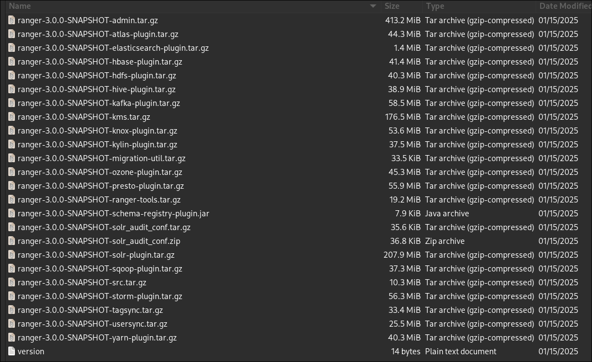
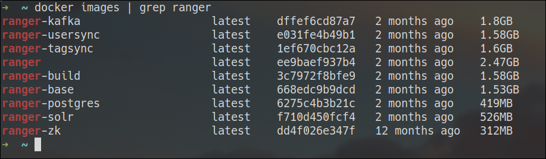
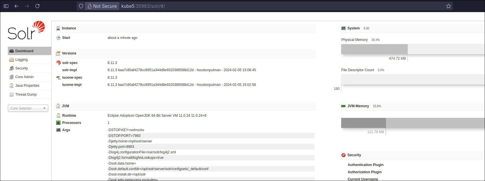
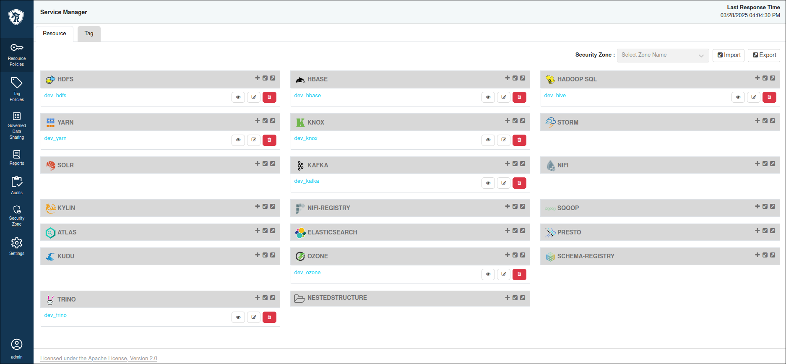

# Apache Ranger

> Apache Ranger™ is a framework designed to enable, monitor, and manage comprehensive data security across the Hadoop ecosystem.

Ranger Admin provides a user interface for managing policies and auditing. Plugins periodically fetch policies from the Ranger Admin and must be installed in the same environment as the services they protect. In Kubernetes, these plugins need to run within the same container as the service. Therefore, we must create Docker images that include the Ranger plugins for Hive and HDFS.

The Ranger installation process can be divided into two phases:

1. Ranger Admin setup
2. Service plugin installation

## Building Ranger

Apache Ranger does not provide pre-built Docker images or plugins. As a result, we need to build the Docker images and plugins manually before proceeding with the installation.


Run the following commands to clone the Apache Ranger repository:
```sh
git clone https://github.com/apache/ranger.git
cd ranger
```
!!! warning
    The changes below are just workaround. [link](https://stackoverflow.com/questions/77535042/hive-metastore-standalone-and-apache-ranger-integration/77545150#77545150)

By default, Hive Metastore plugin support is disabled in the Ranger Hive Plugin. To enable it, modify the following section in `hive-agent/src/main/java/org/apache/ranger/authorization/hive/authorizer/RangerHiveAuthorizer.java`:

```java
...
if (sessionContext != null) {
     switch (sessionContext.getClientType()) {
          case HIVECLI:
               appType = "hiveCLI";
               break;

          case HIVESERVER2:
               appType = "hiveServer2";
               break;

          /* !!! UNCOMMENT !!! */
          case HIVEMETASTORE:
               appType = "hiveMetastore";
               break;

          case OTHER:
               appType = "other";
               break;
     }
}
...
```
To resolve a bug related to setting the owner of databases or tables, update the `setOwnerUser` function as follows:
```java
    static void setOwnerUser(RangerHiveResource resource, HivePrivilegeObject hiveObj, IMetaStoreClient metaStoreClient, Map<String, String> objOwners) {
        if (hiveObj != null) {
            resource.setOwnerUser(hiveObj.getOwnerName());
        }

        LOG.debug("setOwnerUser({}): ownerName={}", hiveObj, resource.getOwnerUser());
    }
```

After applying the necessary changes, build Ranger Docker images and plugins using the following command. Ensure Docker is installed and running on your system:

```sh
export ENABLED_RANGER_SERVICES="tagsync,hadoop,hbase,kafka,hive,knox,kms"
./ranger_in_docker up
``` 
!!! warning
     This process can take up to an hour to complete. 

Once the build is finished, the plugins will be available in the `ranger/dev-support/ranger-docker/dist/` directory.



The required Docker images will also be generated:



The build process creates a development environment with many unnecessary Docker services. You can disable them using the following command:
```bash
./ranger_in_docker down
```
For Hive and HDFS, we will need the following:

- `ranger-3.0.0-SNAPSHOT-hive-plugin.tar.gz`
- `ranger-3.0.0-SNAPSHOT-hdfs-plugin.tar.gz`
- `ranger` and `ranger-usersync` Docker images

!!! warning
    If you plan to use Ranger with other services, you will need the corresponding service plugins.

Tag and push the `ranger` Docker image to your Docker repository:
```bash
docker tag ranger:latest kube5:30123/ranger:latest
docker push kube5:30123/ranger:latest
```

## Kerberos Configuration

The Ranger Admin server requires the following Kerberos principals:
```bash
HTTP/ranger.company.bigdata.svc.cluster.local@HOMELDAP.ORG
rangeradmin/ranger.company.bigdata.svc.cluster.local@HOMELDAP.ORG
rangerlookup/ranger.company.bigdata.svc.cluster.local@HOMELDAP.ORG
```

Deploy the Kerberos keytabs as a Kubernetes Secret:
```bash
kubectl create -n bigdata secret generic keytab-ranger --from-file=spnego.keytab=./files/spnego.keytab --from-file=rangeradmin.keytab=./files/rangeradmin.keytab --from-file=rangerlookup.keytab=./files/rangerlookup.keytab
```

## Solr Integration

Ranger uses Solr to monitor audit logs in real time. The required Solr configuration files are included in the repository. Deploy Solr and its configurations using the following commands:

```sh
kubectl create configmap solr-config -n bigdata --from-file=solrconfig.xml=./ranger_configs/solrconfig.xml --from-file=managed-schema=./ranger_configs/managed-schema
kubectl apply -f solr.yaml
```
You can access the Solr Admin UI via the NodePort service at **http://dns_or_ip_of_any_k8s_node:30983**.



## Ranger Admin Setup

Ranger Admin requires configuration files. Below is an example of the minimal configuration needed. Update the database settings to match your environment.

Ranger requires backend database, you may need to change related database configurations in accordance with your environment.

=== "files/ranger-admin-install.properties"
     ```config
     PYTHON_COMMAND_INVOKER=python3
     RANGER_ADMIN_LOG_DIR=/var/log/ranger
     RANGER_PID_DIR_PATH=/var/run/ranger
     DB_FLAVOR=POSTGRES
     SQL_CONNECTOR_JAR=/usr/share/java/postgresql.jar
     RANGER_ADMIN_LOGBACK_CONF_FILE=/opt/ranger/admin/ews/webapp/WEB-INF/classes/conf/logback.xml

     db_root_user=root
     db_root_password=142536
     db_host=192.168.122.18:5432

     db_name=ranger
     db_user=root
     db_password=142536

     postgres_core_file=db/postgres/optimized/current/ranger_core_db_postgres.sql
     postgres_audit_file=db/postgres/xa_audit_db_postgres.sql
     mysql_core_file=db/mysql/optimized/current/ranger_core_db_mysql.sql
     mysql_audit_file=db/mysql/xa_audit_db.sql

     rangerAdmin_password=rangerR0cks!
     rangerTagsync_password=rangerR0cks!
     rangerUsersync_password=rangerR0cks!
     keyadmin_password=rangerR0cks!


     audit_store=solr
     audit_solr_urls=http://solr.company.bigdata.svc.cluster.local:8983/solr/ranger_audits
     audit_solr_collection_name=ranger_audits

     # audit_store=elasticsearch
     audit_elasticsearch_urls=
     audit_elasticsearch_port=9200
     audit_elasticsearch_protocol=http
     audit_elasticsearch_user=elastic
     audit_elasticsearch_password=elasticsearch
     audit_elasticsearch_index=ranger_audits
     audit_elasticsearch_bootstrap_enabled=true

     policymgr_external_url=http://ranger.company.bigdata.svc.cluster.local:6080
     policymgr_http_enabled=true

     unix_user=ranger
     unix_user_pwd=ranger
     unix_group=ranger

     # Following variables are referenced in db_setup.py. Do not remove these
     oracle_core_file=
     sqlserver_core_file=
     sqlanywhere_core_file=
     cred_keystore_filename=


     # #------------ Kerberos Config -----------------
     spnego_principal= HTTP/ranger.company.bigdata.svc.cluster.local@HOMELDAP.ORG
     spnego_keytab= /etc/security/keytabs/spnego.keytab
     token_valid=30
     cookie_domain=
     cookie_path=/
     admin_principal= rangeradmin/ranger.company.bigdata.svc.cluster.local@HOMELDAP.ORG
     admin_keytab= /etc/security/keytabs/rangeradmin.keytab
     lookup_principal= rangerlookup/ranger.company.bigdata.svc.cluster.local@HOMELDAP.ORG
     lookup_keytab= /etc/security/keytabs/rangerlookup.keytab
     hadoop_conf=/hadoop-conf

     # #################  DO NOT MODIFY ANY VARIABLES BELOW #########################
     #
     # --- These deployment variables are not to be modified unless you understand the full impact of the changes
     #
     ################################################################################
     XAPOLICYMGR_DIR=$PWD
     app_home=$PWD/ews/webapp
     TMPFILE=$PWD/.fi_tmp
     LOGFILE=$PWD/logfile
     LOGFILES="$LOGFILE"

     JAVA_BIN='java'
     JAVA_VERSION_REQUIRED='1.8'

     ranger_admin_max_heap_size=1g
     #retry DB and Java patches after the given time in seconds.
     PATCH_RETRY_INTERVAL=120
     STALE_PATCH_ENTRY_HOLD_TIME=10

     authentication_method=NONE
     ```
=== "files/log4j.xml"
     ```xml
     <category name="org.apache.ranger" additivity="false">
     <priority value="debug" />
     <appender-ref ref="xa_log_appender" />
     </category>
     ```

Deploy ranger configurations as ConfigMap:
```bash
kubectl create configmap ranger-config -n bigdata --from-file=ranger-admin-install.properties=./configs/ranger-admin-install.properties --from-file=log4j.xml=./configs/log4j.xml
```

Use the following YAML file to deploy Ranger Admin:

=== "ranger.yaml"
```yaml
apiVersion: v1
kind: Pod
metadata:
  name: ranger
  namespace: bigdata
  labels:
    name: ranger
    app: ranger
    dns: hdfs-subdomain
spec:
  hostname: ranger
  subdomain: company
  containers:
  - name: ranger
    image: kube5:30123/ranger:latest
    imagePullPolicy: Always
    resources:
      limits:
        memory: "2G"
        cpu: "500m"
    volumeMounts:
    - name: ranger-config
      mountPath: /opt/ranger/admin/install.properties
      subPath: ranger-admin-install.properties
    - name: ranger-config
      mountPath: /opt/ranger/admin/ews/webapp/WEB-INF/log4j.xml
      subPath: log4j.xml
    - name: keytab-ranger
      mountPath: /etc/security/keytabs/
    - name: hadoop-config
      mountPath: /hadoop-conf
    - name: krb5conf
      mountPath: /etc/krb5.conf
      subPath: krb5.conf
  volumes:
  - name: ranger-config
    configMap:
      name: ranger-config
  - name: hadoop-config
    configMap:
      name: hadoop-config
  - name: keytab-ranger
    secret:
      secretName: keytab-ranger
  - name: krb5conf
    configMap:
      name: krb5conf
---
apiVersion: v1
kind: Service
metadata:
  name: ranger-np
  namespace: bigdata
spec:
  type: NodePort
  selector:
    app: ranger
  ports:
  - port: 6080
    targetPort: 6080
    nodePort: 30680
```

```bash
kubectl apply -f ranger.yaml
```
The firs run takes some minutes. Once deployed, you can access the Ranger Admin UI at **http://dns_or_ip_of_any_k8s_node:30680**

> **Username:** `admin`  
> **Password:** `rangerR0cks!`



## Ranger UserSync
Ranger UserSync periodically synchronizes users from LDAP or UNIX into the Ranger database. If you don’t need this feature, you can manually add users via the Ranger Admin UI under **Admin > Users**. Ranger only verifies the username, so you can assign any password.

The `ranger-usersync` Docker image built earlier can be used if you decide to enable UserSync in the future.