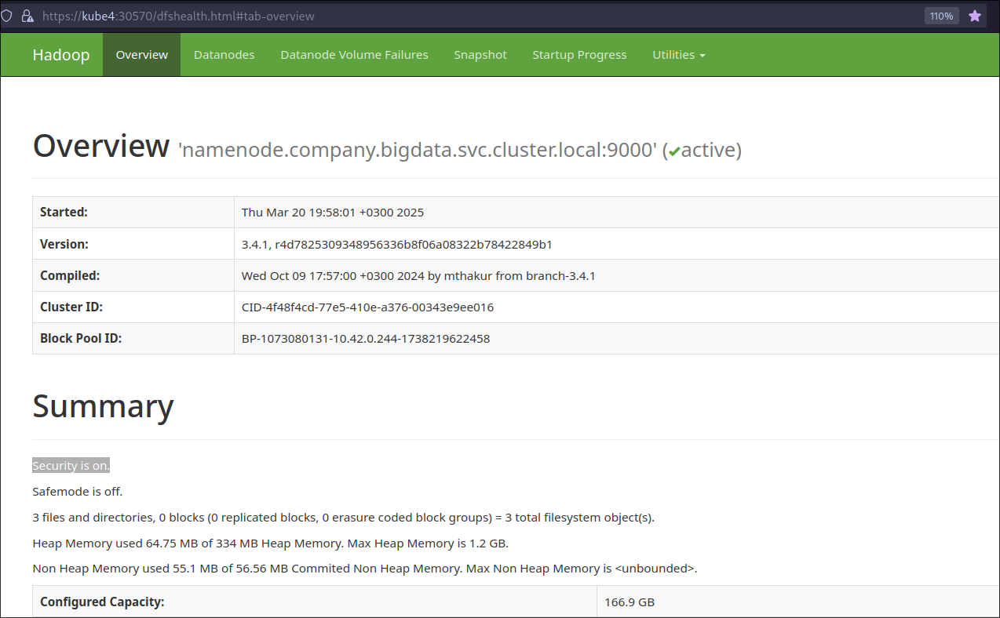
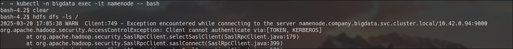
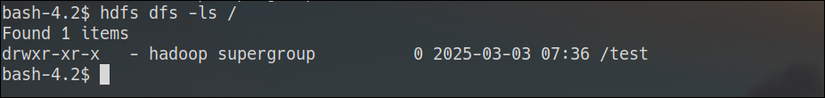

# Secure HDFS
## Creating required principals and certificates

### Kerberos Principals
HDFS requires both `hdfs` and `host` principals for each node. In this example, the Kerberos realm is HOMELDAP.ORG. The following principals need to be created:
```bash
hdfs/namenode.company.bigdata.svc.cluster.local@HOMELDAP.ORG
host/namenode.company.bigdata.svc.cluster.local@HOMELDAP.ORG
hdfs/datanode01.company.bigdata.svc.cluster.local@HOMELDAP.ORG
host/datanode01.company.bigdata.svc.cluster.local@HOMELDAP.ORG
hdfs/datanode02.company.bigdata.svc.cluster.local@HOMELDAP.ORG
host/datanode02.company.bigdata.svc.cluster.local@HOMELDAP.ORG
hdfs/datanode03.company.bigdata.svc.cluster.local@HOMELDAP.ORG
host/datanode03.company.bigdata.svc.cluster.local@HOMELDAP.ORG
```

Generate keytabs using `ktutil`:

```bash
ktutil
add_entry -password -p hdfs/namenode.company.bigdata.svc.cluster.local@HOMELDAP.ORG -k 1 -e aes128-cts-hmac-sha1-96
add_entry -password -p hdfs/namenode.company.bigdata.svc.cluster.local@HOMELDAP.ORG -k 1 -e aes256-cts-hmac-sha1-96
add_entry -password -p hdfs/namenode.company.bigdata.svc.cluster.local@HOMELDAP.ORG -k 1 -e aes128-cts-hmac-sha256-128
add_entry -password -p host/namenode.company.bigdata.svc.cluster.local@HOMELDAP.ORG -k 1 -e aes128-cts-hmac-sha1-96
add_entry -password -p host/namenode.company.bigdata.svc.cluster.local@HOMELDAP.ORG -k 1 -e aes256-cts-hmac-sha1-96
add_entry -password -p host/namenode.company.bigdata.svc.cluster.local@HOMELDAP.ORG -k 1 -e aes128-cts-hmac-sha256-128
wkt ./files/namenode.keytab
```

These keytabs should be deployed as Kubernetes Secrets:

```sh
kubectl create -n bigdata secret generic keytab-hdfs-namenode --from-file=./files/namenode.keytab
kubectl create -n bigdata secret generic keytab-hdfs-datanode-01 --from-file=datanode.keytab=./files/datanode01.keytab
kubectl create -n bigdata secret generic keytab-hdfs-datanode-02 --from-file=datanode.keytab=./files/datanode02.keytab
kubectl create -n bigdata secret generic keytab-hdfs-datanode-03 --from-file=datanode.keytab=./files/datanode03.keytab
```

### krb5.conf
To allow Hadoop services to communicate with the KDC, a custom `krb5.conf` file is needed. Below is a sample configuration:

=== "krb5.conf"
```bash
[libdefaults]
default_realm = HOMELDAP.ORG
dns_canonicalize_hostname = true
[realms]
HOMELDAP.ORG = {
        admin_server = kdc.homeldap.org
        kdc = kdc.homeldap.org
}
```
Deploy it using:
```sh
kubectl create configmap krb5conf -n bigdata --from-file=krb5.conf=./files/krb5.conf
```
### SSL Certificates
To enable secure communication, we need to generate a certificate, along with keystore and truststore files. It's important that the Common Name (CN) or Subject Alternative Names (SANs) in the certificate include the HDFS node hostnames. Wildcard certificates are supported by HDFS.
```bash
DOMAIN="*.company.bigdata.svc.cluster.local"    # Replace with your domain
```
A script for generating the required self-signed certificate and associated files is available in the GitHub repository.

Deploy the keystore and truststore as a Kubernetes Secret:

```sh
kubectl create -n bigdata secret generic keystore-hdfs --from-file=keystore=./files/keystore --from-file=truststore=./files/truststore
```

## Configurations

Update the following configuration files: `core-site.xml` and `hdfs-site.xml`.

=== "configs/core-site.xml"
    ```xml
    <configuration>
      <property>
          <name>fs.defaultFS</name>
          <value>hdfs://namenode.company.bigdata.svc.cluster.local:9000</value>
      </property>
      <!-- Kerberos Configs -->
      <property>
          <name>hadoop.security.authentication</name>
          <value>kerberos</value>
      </property>
      <property>
          <name>hadoop.security.authorization</name>
          <value>true</value>
      </property>
      <property>
          <name>hadoop.rpc.protection</name>
          <value>authentication</value>
      </property>
      <property>
          <name>hadoop.security.auth_to_local</name>
          <value>
            RULE:[2:$1@$0](hdfs@HOMELDAP.ORG)s/(.*)@HOMELDAP.ORG/hdfs/
            RULE:[2:$1@$0](hive@HOMELDAP.ORG)s/(.*)@HOMELDAP.ORG/hive/
            RULE:[2:$1@$0](rangerlookup@HOMELDAP.ORG)s/(.*)@HOMELDAP.ORG/rangerlookup/
            RULE:[2:$1@$0](rangeradmin@HOMELDAP.ORG)s/(.*)@HOMELDAP.ORG/rangeradmin/
            DEFAULT
          </value>
      </property>

      <property>
          <name>hadoop.sql.require.client.cert</name>
          <value>false</value>
      </property>


    </configuration>
    ```
=== "configs/hdfs-site.xml"

    ```xml { .py style="--md-codeblock-height: 200px" }
    <configuration>
      <property>
          <name>dfs.namenode.name.dir</name>
          <value>/hadoop/nn</value>
          <description>Determines where on the local filesystem the DFS name node
              should store the name table. If this is a comma-delimited list
              of directories then the name table is replicated in all of the
              directories, for redundancy. </description>
          <final>true</final>
      </property>
      <property>
          <name>dfs.datanode.data.dir</name>
          <value>/hadoop/disk1</value>
          <description>Determines where on the local filesystem an DFS data node
              should store its blocks. If this is a comma-delimited
              list of directories, then data will be stored in all named
              directories, typically on different devices.
              Directories that do not exist are ignored.
          </description>
          <final>true</final>
      </property>
      <property>
          <name>dfs.webhdfs.enable</name>
          <value>true</value>
      </property>
      <property>
          <name>dfs.heartbeat.interval</name>
          <value>3</value>
          <description>Determines datanode heartbeat interval in seconds.
          </description>
      </property>
      <property>
          <name>dfs.http.address</name>
          <value>0.0.0.0:50070</value>
          <description>The name of the default file system. Either the
              literal string "local" or a host:port for NDFS.
          </description>
          <final>true</final>
      </property>
      <property>
          <name>dfs.https.port</name>
          <value>50470</value>
          <description>The https port where namenode binds</description>
      </property>
      <property>
          <name>dfs.https.address</name>
          <value>0.0.0.0:50470</value>
          <description>The https address where namenode binds</description>
      </property>
      <property>
          <name>dfs.namenode.datanode.registration.ip-hostname-check</name>
          <value>false</value>
      </property>
      <property>
          <name>dfs.permissions.enabled</name>
          <value>true</value>
      </property>
      <property>
          <name>dfs.permissions</name>
          <value>true</value>
      </property>
      <property>
          <name>dfs.permissions.ContentSummary.subAccess</name>
          <value>true</value>
      </property>
      <property>
          <name>dfs.block.access.token.enable</name>
          <value>true</value>
      </property>
      <property>
          <name>dfs.namenode.kerberos.principal</name>
          <value>hdfs/_HOST@HOMELDAP.ORG</value>
      </property>
      <property>
          <name>dfs.namenode.keytab.file</name>
          <value>/etc/security/keytab/namenode.keytab</value>
      </property>
      <property>
          <name>dfs.namenode.kerberos.internal.spnego.principal</name>
          <value>hdfs/_HOST@HOMELDAP.ORG</value>
      </property>
      <property>
          <name>dfs.namenode.acls.enabled</name>
          <value>false</value>
      </property>
      <property>
          <name>dfs.datanode.data.dir.perm</name>
          <value>700</value>
      </property>
      <property>
          <name>dfs.datanode.address</name>
          <value>0.0.0.0:9866</value>
      </property>
      <property>
          <name>dfs.datanode.http.address</name>
          <value>0.0.0.0:9868</value>
      </property>
      <property>
          <name>dfs.datanode.https.address</name>
          <value>0.0.0.0:9865</value>
      </property>
      <property>
          <name>dfs.datanode.kerberos.principal</name>
          <value>hdfs/_HOST@HOMELDAP.ORG</value>
      </property>
      <property>
          <name>dfs.datanode.keytab.file</name>
          <value>/etc/security/keytab/datanode.keytab</value>
      </property>
      <property>
          <name>dfs.encrypt.data.transfer</name>
          <value>true</value>
      </property>
      <property>
          <name>dfs.encrypt.data.transfer.algorithm</name>
          <value>rc4</value>
      </property>
      <property>
          <name>dfs.data.transfer.protection</name>
          <value>integrity</value>
      </property>
      <property>
          <name>dfs.http.policy</name>
          <value>HTTPS_ONLY</value>
      </property>

    </configuration>
    ```

To enable SSL, create a separate configuration file named `ssl-server.xml`:

> Be sure to change the default passwords for both the keystore and truststore.

=== "configs/ssl-server.xml"
```xml
<configuration>
    <property>
        <name>ssl.server.keystore.location</name>
        <value>/etc/security/ssl/keystore</value>
        <description>Keystore to be used. Must be specified.
        </description>
    </property>
    <property>
        <name>ssl.server.keystore.password</name>
        <value>Bigdata1</value>
    </property>
    <property>
        <name>ssl.server.keystore.keypassword</name>
        <value>Bigdata1</value>
    </property>
    <property>
        <name>ssl.server.keystore.type</name>
        <value>JKS</value>
    </property>
    <property>
        <name>ssl.server.truststore.type</name>
        <value>JKS</value>
    </property>
    <property>
        <name>ssl.server.truststore.location</name>
        <value>/etc/security/ssl/truststore</value>
        <description>Truststore to be used by NN and DN. Must be specified.
        </description>
    </property>
    <property>
        <name>ssl.server.truststore.password</name>
        <value>Bigdata1</value>
        <description>Optional. Default value is "".
        </description>
    </property>
</configuration>
```

To apply the updated configuration, delete and recreate the config map:

```bash
kubectl delete configmap hadoop-config -n bigdata
kubectl create configmap hadoop-config -n bigdata --from-file=core-site.xml=./configs/core-site.xml --from-file=hdfs-site.xml=./configs/hdfs-site.xml  --from-file=ssl-server.xml=./configs/ssl-server.xml
```
## KDC Server DNS
To resolve the KDC server inside pods, use the `hostAliases` feature to update the `/etc/hosts` file. This step may not be required if your cluster is configured with DNS resolution for the KDC.

=== "namenode.yaml/datanode_01.yaml"
```yaml
...
spec:
  nodeSelector:
    kubernetes.io/hostname: "kube1"
  hostname: namenode
  subdomain: company
  hostAliases:
  - ip: "192.168.1.52"
    hostnames:
    - "kdc.homeldap.org"
  containers:
  - name: namenode
    image: apache/hadoop:3.4.1
...
```
Make sure the IP address corresponds to the actual IP of KDC server.

## Mounting Configs and Secrets
Mount the configuration files and secrets in Hadoop service manifests.

=== "namenode.yaml"
    ```yaml
    ...

    volumeMounts:
    - name: hadoop-config
      mountPath: /opt/hadoop/etc/hadoop/ssl-server.xml
      subPath: ssl-server.xml
    - name: krb5conf
      mountPath: /etc/krb5.conf
      subPath: krb5.conf
    - name: keytab-hdfs-namenode
      mountPath: /etc/security/keytab/namenode.keytab
      subPath: namenode.keytab
    - name: keystore-hdfs
      mountPath: /etc/security/ssl/

    ...

    volumes:
    - name: krb5conf
      configMap:
        name: krb5conf
    - name: keytab-hdfs-namenode
      secret:
        secretName: keytab-hdfs-namenode
    - name: keystore-hdfs
      secret:
        secretName: keystore-hdfs
    ...
    ```

=== "datanode_01.yaml"
    ```yaml

    ...

    volumeMounts:
    - name: hadoop-config
      mountPath: /opt/hadoop/etc/hadoop/ssl-server.xml
      subPath: ssl-server.xml
    - name: krb5conf
      mountPath: /etc/krb5.conf
      subPath: krb5.conf
    - name: keytab-hdfs-datanode-01
      mountPath: /etc/security/keytab/datanode.keytab
      subPath: datanode.keytab
    - name: keystore-hdfs
      mountPath: /etc/security/ssl/

    ...

    volumes:
    - name: krb5conf
      configMap:
        name: krb5conf
    - name: keytab-hdfs-datanode-01
      secret:
        secretName: keytab-hdfs-datanode-01
    - name: keystore-hdfs
      secret:
        secretName: keystore-hdfs
    ...
    ```

Finally, redeploy the services:
```sh
kubectl apply -f namenode.yaml
kubectl apply -f datanode_01.yaml
kubectl apply -f datanode_02.yaml
kubectl apply -f datanode_03.yaml
```
You can access secure namenode WEB UI via **https://dns_or_ip_of_any_k8s_node:30570**



## Test

To test the setup, start by accessing the NameNode container:
```sh
kubectl -n bigdata exec -it namenode -- bash
```
Running HDFS commands without obtaining a Kerberos ticket will result in an authentication error:



To authenticate, run the following command:

```sh
kinit -kt /etc/security/keytab/namenode.keytab hdfs/namenode.company.bigdata.svc.cluster.local@HOMELDAP.ORG
```
Once authenticated, HDFS commands should work as expected:

