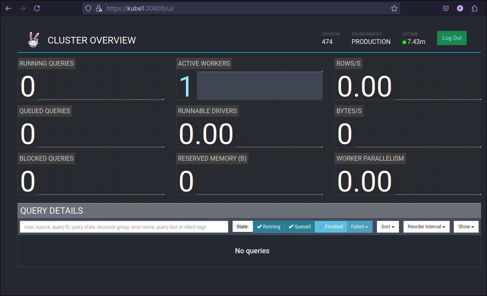
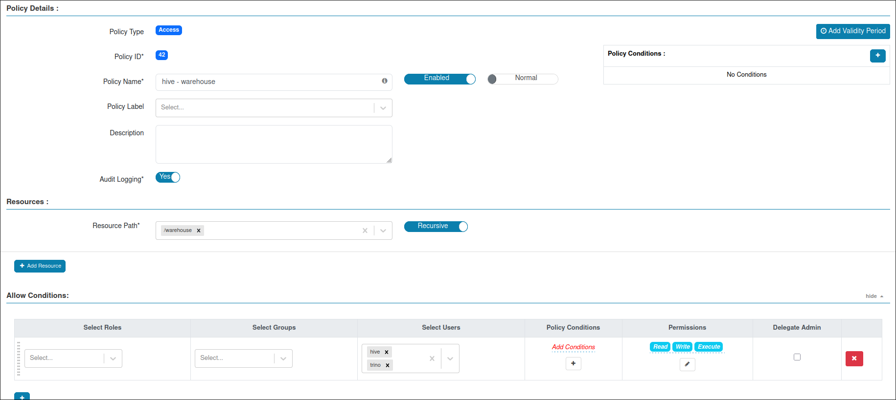
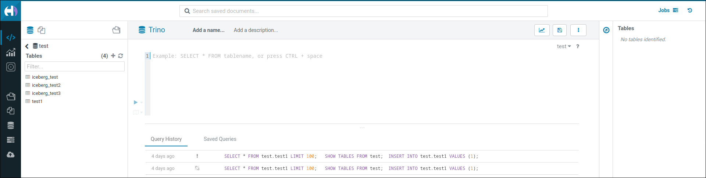

# Trino

> Trino,fast distributed SQL query engine for big data analytics that helps you explore your data universe.

## Helm Chart

Pull and extract helm chart:

```bash
helm pull trino/trino
tar -xvzf trino-1.35.0.tgz
mv trino chart
```
## Kerberos Authentication

Trino requires the following Kerberos principal:

```bash
trino@HOMELDAP.ORG # user to access other service for example HDFS, Hive etc.
HTTP/trino-coordinator.example.com@HOMELDAP.ORG # user that using kerberos authentication
```

`trino-coordinator.example.com` should be access URL of the coordinator. I used `kube1` as coordinator URL.
My `trino.keytab` looks like below:
```bash
>klist -kte files/trino.keytab 
Keytab name: FILE:files/trino.keytab
KVNO Timestamp           Principal
---- ------------------- ------------------------------------------------------
   1 01/14/2025 00:17:05 trino@HOMELDAP.ORG (aes128-cts-hmac-sha1-96) 
   1 01/14/2025 00:17:05 trino@HOMELDAP.ORG (aes256-cts-hmac-sha1-96) 
   1 01/14/2025 00:17:05 trino@HOMELDAP.ORG (aes128-cts-hmac-sha256-128) 
   1 04/21/2025 09:36:33 HTTP/kube1@HOMELDAP.ORG (aes128-cts-hmac-sha1-96) 
   1 04/21/2025 09:36:33 HTTP/kube1@HOMELDAP.ORG (aes256-cts-hmac-sha1-96) 
   1 04/21/2025 09:36:33 HTTP/kube1@HOMELDAP.ORG (aes128-cts-hmac-sha256-128) 
```

Deploy the Kerberos keytab as a Kubernetes Secret:
```bash
kubectl create -n bigdata secret generic keytab-trino --from-file=./files/trino.keytab
```
## TLS/HTTPS Settings

>When using Kerberos authentication, access to the Trino coordinator must be through TLS and HTTPS.

!!! tip
    You can use `ssl.sh` to create self-signed certs, in the repository. 

Deploy keystore as Kubernetes secret:
```bash
kubectl create -n bigdata secret generic trino-keystore --from-file=./files/keystore
```
## Hadoop Proxy User/Impersonation

Add trino user to `core-site.xml`:

=== "core-site.xml"
```xml
...
   <property>
      <name>hadoop.proxyuser.trino.hosts</name>
      <value>*</value>
   </property>
   <property>
      <name>hadoop.proxyuser.trino.groups</name>
      <value>*</value>
   </property>
   <property>
      <name>hadoop.proxyuser.trino.users</name>
      <value>*</value>
   </property>
... 
```
## Configuration

!!! tip
    We are using Hive metastore as iceberg catalog. You can [add more connections](https://trino.io/docs/current/connector.html) to Trino. 

!!! tip
    Trino provides very detailed [helm chart documentation](https://trinodb.github.io/charts/charts/trino/). 


=== "values.yaml"
```yaml
server:
  workers: 1
  coordinatorExtraConfig: |
    internal-communication.shared-secret=aPM9WVbktUsslZ8amzrPmdCwQjUiMBcqTJMotIK7BrzLzANCYJQm6170qYMj//Oo+NKS7I9UrzdN
    http-server.authentication.type=KERBEROS
    http-server.authentication.krb5.service-name=HTTP
    http-server.authentication.krb5.principal-hostname=kube1
    http-server.authentication.krb5.keytab=/etc/security/keytabs/trino.keytab
    http-server.authentication.krb5.user-mapping.pattern = (.*)(@.*)
    http.authentication.krb5.config=/etc/krb5.conf
    http-server.https.enabled=true
    http-server.https.port=7778
    http-server.https.keystore.path=/etc/security/certs/keystore
    http-server.https.keystore.key=Bigdata1
  workerExtraConfig: |
    internal-communication.shared-secret=aPM9WVbktUsslZ8amzrPmdCwQjUiMBcqTJMotIK7BrzLzANCYJQm6170qYMj//Oo+NKS7I9UrzdN

image:
  tag: "474"
coordinator:
  configMounts:
  - name: hadoop-config
    configMap: hadoop-config
    path: /hadoop-conf
  - name: hive-site-config
    configMap: hive-site-config
    path: /hive-conf  
worker:
  configMounts:
  - name: hadoop-config
    configMap: hadoop-config
    path: /hadoop-conf 
  - name: hive-site-config
    configMap: hive-site-config
    path: /hive-conf  

configMounts:
 - name: krb5conf
   configMap: krb5conf
   path: /etc/krb5.conf
   subPath: krb5.conf
   
secretMounts:
- name: keytab-trino
  secretName: keytab-trino
  path: /etc/security/keytabs/
- name: trino-keystore
  secretName: trino-keystore
  path: /etc/security/certs/  

additionalLogProperties:
- io.trino.plugin.hive.metastore.thrif=DEBUG
catalogs:
  lakehouse: |-
    connector.name=iceberg
    hive.metastore.uri=thrift://metastore.company.bigdata.svc.cluster.local:9083
    fs.hadoop.enabled = true
    hive.config.resources = /hadoop-conf/core-site.xml, /hadoop-conf/hdfs-site.xml, /hive-conf/hive-site.xml
    hive.hdfs.impersonation.enabled=false
    hive.hdfs.authentication.type = KERBEROS
    hive.hdfs.trino.principal = trino@HOMELDAP.ORG
    hive.hdfs.trino.keytab = /etc/security/keytabs/trino.keytab
    hive.metastore.authentication.type=KERBEROS
    hive.metastore.thrift.impersonation.enabled=true
    hive.metastore.service.principal=hive/_HOST@HOMELDAP.ORG
    hive.metastore.client.principal=trino@HOMELDAP.ORG
    hive.metastore.client.keytab=/etc/security/keytabs/trino.keytab
    hive.metastore.thrift.client.connect-timeout=1h
    hive.metastore.thrift.client.read-timeout=1h
    iceberg.metadata-cache.enabled=false

accessControl:
  type: configmap
  configFile: "rules.json"
  rules:
    rules.json: |-
      {
        "impersonation": [
          {
            "original_user": "trino",
            "new_user": ".*",
            "allow": true

          },
          {
            "original_user": "hue",
            "new_user": ".*",
            "allow": true

          }
        ]
      }
```

!!! tip
    Modify `deployment-coordinator.yaml` and `deployment-worker.yaml` in Helm chart to mount `krb5.conf`correctly and to add Kerberos server DNS records:
    ```yaml
    ...
     spec:
      hostAliases:
      - ip: "192.168.1.52"
        hostnames:
        - "kdc.homeldap.org"
      serviceAccountName: 
    ...
     {{- range .Values.configMounts }}
      - name: {{ .name }}
        mountPath: {{ .path }}
        subPath: {{ .subPath }}
     {{- end }}
    ...
    ```

Deploy Trino:
```bash
helm install -f values.yaml trino ./chart -n bigdata
```



If you have a valid Kerberos ticket, you should access to Trino using Kerberos authentication. You may need do some configuration on your browser settings. Follow [Cern Kerberos guide](https://auth.docs.cern.ch/user-documentation/kerberos-authentication/#linux) for required settings.
## Ranger policies
Add trino user to `/warehouse` path access policy:




## Access Trino using Hue

Add trino configurations to Hue `values.yaml` as interpreter.
```yaml
...
     name: "hue" # You must create hue database before deployment
  interpreters: |
    [[[trino]]]
      name = Trino
      interface=sqlalchemy
      options='{"url": "trino://kube1:30808/lakehouse", "has_impersonation": true, "connect_args": "{\"protocol\": \"https\", \"KerberosKeytabPath\":\"/etc/security/keytabs/hue.keytab\", \"KerberosPrincipal\":\"hue@HOMELDAP.ORG\", \"KerberosRemoteServiceName\":\"HTTP\",\"KerberosCredentialCachePath\":\"/tmp/krb5cc_1001\",\"requests_kwargs\": {\"verify\": false}}"}'
  ini: |
    [desktop]
...
```
Upgrade Hue helm:
```bash
helm upgrade hue ./chart -n bigdata -f values.yaml # Update
```

Now you should access Trino using Hue.



## Authorization

Since Trino uses the Hive Metastore, and the Ranger plugin has already been installed on the Metastore, no additional authorization configuration is required. Trino will enforce the policies defined for the Hive tables. Accesses made from Trino are logged in the Ranger audit as the `hiveMetastore` application.
